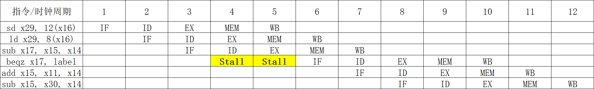

### (1)
流水线图及发生停顿的位置如图所示：

### (2)
不可以。
- 指令和数据共享同一个存储器，每条访存指令都会带来指令执行周期中的第二次访存操作
- 由于每条指令都需要在开始执行时（`IF` 段）进行一次访存，因此不论指令如何重排，当一条访存指令执行到 `MEM` 段时，本应在该时钟周期内进入流水线的指令（即 +3 指令）必须停顿
- 因此，**指令重排不会影响特定的指令片段在流水线中造成的总停顿次数**

### (3)
- 该结构冒险必须通过硬件解决。现有的 CPU 结构不允许取指和访问数据内存并行进行，因此必然会带来流水线的停顿
- 即使引入 `NOP` 指令，其在执行时也需要经过取指 `IF` 流水段，不仅无法优化 CPU 性能，还会给 CPU 带来**额外的有效指令执行延迟**

### (4)
会引入额外停顿的指令包括 `ld, sd`，总占比为 $36\%$。因此，假设指令总数为 $N$，则大约需要为该结构冒险产生 **$0.36N$ 个周期的停顿**
