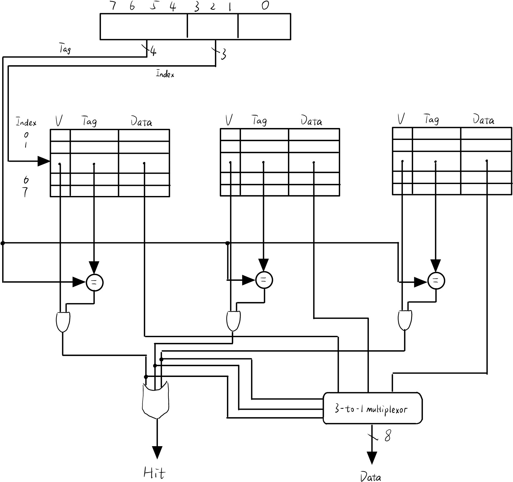
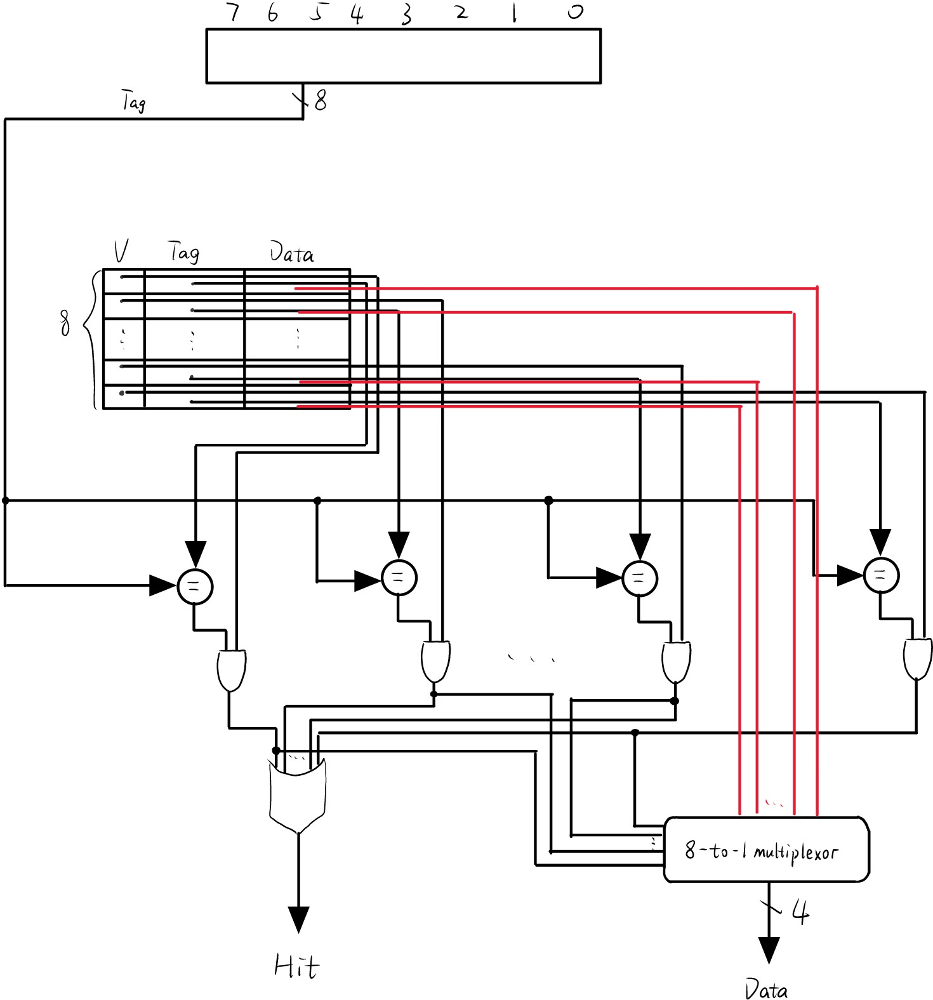
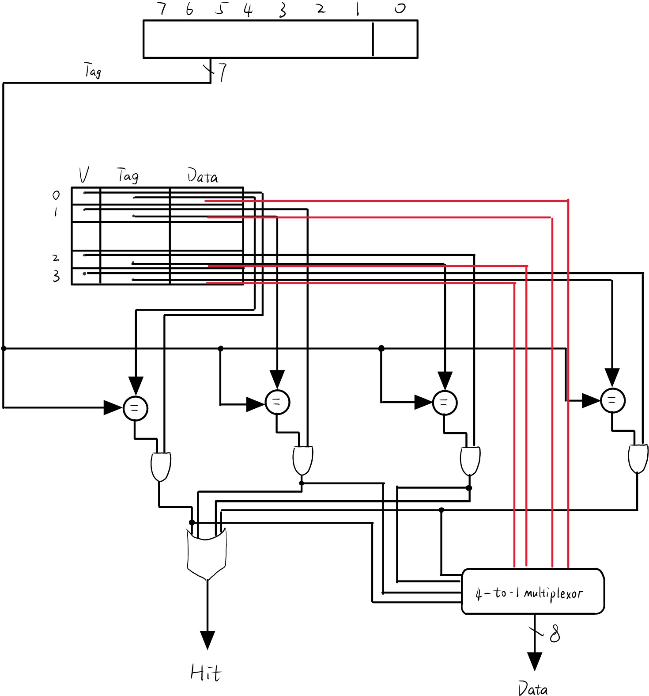

### (1)
块大小为 2 字，总容量为 48 字的三路组相连 Cache 组织结构图如下：

### (2)
采用 LRU 替换策略，对于 (1) 中的 Cache，每次访问后 Cache 情况如下：
| 十六进制地址 | 二进制字地址 | Tag | Index | Offset | 命中/失效 | 处理访问后目标 Cache Set 的 Tag 状态 |
| :---: | :---: | :---: | :---: | :---: | :---: | :--- |
| `0x03` | `0000 0011` | `0000` | `001(1)` | `1` | 失效 | `[0000, N/A, N/A]` |
| `0xb4` | `1011 0100` | `1011` | `010(2)` | `0` | 失效 | `[1011, N/A, N/A]` |
| `0x2b` | `0010 1011` | `0010` | `101(5)` | `1` | 失效 | `[0010, N/A, N/A]` |
| `0x02` | `0000 0010` | `0000` | `001(1)` | `0` | 命中 | `[0000, N/A, N/A]` |
| `0xbe` | `1011 1110` | `1011` | `111(7)` | `0` | 失效 | `[1011, N/A, N/A]` |
| `0x58` | `0101 1000` | `0101` | `100(4)` | `0` | 失效 | `[0101, N/A, N/A]` |
| `0xbf` | `1011 1111` | `1011` | `111(7)` | `1` | 命中 | `[1011, N/A, N/A]` |
| `0x0e` | `0000 1110` | `0000` | `111(7)` | `0` | 失效 | `[1011, 0000, N/A]` |
| `0x1f` | `0001 1111` | `0001` | `111(7)` | `1` | 失效 | `[1011, 0000, 0001]` |
| `0xb5` | `1011 0101` | `1011` | `010(2)` | `1` | 命中 | `[1011, N/A, N/A]` |
| `0xbf` | `1011 1111` | `1011` | `111(7)` | `1` | 命中 | `[1011, 0000, 0001]` |
| `0xba` | `1011 1010` | `1011` | `101(5)` | `0` | 失效 | `[0010, 1011, N/A]` |
| `0x2e` | `0010 1110` | `0010` | `111(7)` | `0` | 失效 | `[1011, 0010, 0001]` |
| `0xce` | `1100 1110` | `1100` | `111(7)` | `0` | 失效 | `[1011, 0010, 1100]` |

### (3)
块大小为 1 字，总容量为 8 字的全相连 Cache 组织结构图如下：

### (4)
采用 LRU 替换策略，对于 (3) 中的 Cache，每次访问后 Cache 情况如下：
| 十六进制地址 | 二进制字地址 | Tag | Index | Offset | 命中/失效 | 处理访问后 Cache Tag 段状态 |
| :---: | :---: | :---: | :---: | :---: | :---: | :--- |
| `0x03` | `0000 0011` | `0000 0011` | `N/A` | `N/A` | 失效 | `[0x03, N/A, N/A, N/A, N/A, N/A, N/A, N/A]` |
| `0xb4` | `1011 0100` | `1011 0100` | `N/A` | `N/A` | 失效 | `[0x03, 0xb4, N/A, N/A, N/A, N/A, N/A, N/A]` |
| `0x2b` | `0010 1011` | `0010 1011` | `N/A` | `N/A` | 失效 | `[0x03, 0xb4, 0x2b, N/A, N/A, N/A, N/A, N/A]` |
| `0x02` | `0000 0010` | `0000 0010` | `N/A` | `N/A` | 失效 | `[0x03, 0xb4, 0x2b, 0x02, N/A, N/A, N/A, N/A]` |
| `0xbe` | `1011 1110` | `1011 1110` | `N/A` | `N/A` | 失效 | `[0x03, 0xb4, 0x2b, 0x02, 0xbe, N/A, N/A, N/A]` |
| `0x58` | `0101 1000` | `0101 1000` | `N/A` | `N/A` | 失效 | `[0x03, 0xb4, 0x2b, 0x02, 0xbe, 0x58, N/A, N/A]` |
| `0xbf` | `1011 1111` | `1011 1111` | `N/A` | `N/A` | 失效 | `[0x03, 0xb4, 0x2b, 0x02, 0xbe, 0x58, 0xbf, N/A]` |
| `0x0e` | `0000 1110` | `0000 1110` | `N/A` | `N/A` | 失效 | `[0x03, 0xb4, 0x2b, 0x02, 0xbe, 0x58, 0xbf, 0x0e]` |
| `0x1f` | `0001 1111` | `0001 1111` | `N/A` | `N/A` | 失效 | `[0x1f, 0xb4, 0x2b, 0x02, 0xbe, 0x58, 0xbf, 0x0e]` |
| `0xb5` | `1011 0101` | `1011 0101` | `N/A` | `N/A` | 失效 | `[0x1f, 0xb5, 0x2b, 0x02, 0xbe, 0x58, 0xbf, 0x0e]` |
| `0xbf` | `1011 1111` | `1011 1111` | `N/A` | `N/A` | 命中 | `[0x1f, 0xb5, 0x2b, 0x02, 0xbe, 0x58, 0xbf, 0x0e]` |
| `0xba` | `1011 1010` | `1011 1010` | `N/A` | `N/A` | 失效 | `[0x1f, 0xb5, 0xba, 0x02, 0xbe, 0x58, 0xbf, 0x0e]` |
| `0x2e` | `0010 1110` | `0010 1110` | `N/A` | `N/A` | 失效 | `[0x1f, 0xb5, 0xba, 0x2e, 0xbe, 0x58, 0xbf, 0x0e]` |
| `0xce` | `1100 1110` | `1100 1110` | `N/A` | `N/A` | 失效 | `[0x1f, 0xb5, 0xba, 0x2e, 0xce, 0x58, 0xbf, 0x0e]` |

### (5)
块大小为 2 字，总容量为 8 字的全相连 Cache 组织结构图如下：

### (6)
采用 LRU 替换策略，对于 (5) 中的 Cache，每次访问后 Cache 情况如下：
| 十六进制地址 | 二进制字地址 | Tag | Index | Offset | 命中/失效 | 处理访问后 Cache Tag 段状态 |
| :---: | :---: | :---: | :---: | :---: | :---: | :--- |
| `0x03` | `0000 0011` | `000 0001` | `N/A` | `1` | 失效 | `[0x01, N/A, N/A, N/A]` |
| `0xb4` | `1011 0100` | `101 1010` | `N/A` | `0` | 失效 | `[0x01, 0x5a, N/A, N/A]` |
| `0x2b` | `0010 1011` | `001 0101` | `N/A` | `1` | 失效 | `[0x01, 0x5a, 0x15, N/A]` |
| `0x02` | `0000 0010` | `000 0001` | `N/A` | `0` | 命中 | `[0x01, 0x5a, 0x15, N/A]` |
| `0xbe` | `1011 1110` | `101 1111` | `N/A` | `0` | 失效 | `[0x01, 0x5a, 0x15, 0x5f]` |
| `0x58` | `0101 1000` | `010 1100` | `N/A` | `0` | 失效 | `[0x01, 0x2c, 0x15, 0x5f]` |
| `0xbf` | `1011 1111` | `101 1111` | `N/A` | `1` | 命中 | `[0x01, 0x2c, 0x15, 0x5f]` |
| `0x0e` | `0000 1110` | `000 0111` | `N/A` | `0` | 失效 | `[0x01, 0x2c, 0x07, 0x5f]` |
| `0x1f` | `0001 1111` | `000 1111` | `N/A` | `1` | 失效 | `[0x0f, 0x2c, 0x07, 0x5f]` |
| `0xb5` | `1011 0101` | `101 1010` | `N/A` | `1` | 失效 | `[0x0f, 0x5a, 0x07, 0x5f]` |
| `0xbf` | `1011 1111` | `101 1111` | `N/A` | `1` | 命中 | `[0x0f, 0x5a, 0x07, 0x5f]` |
| `0xba` | `1011 1010` | `101 1101` | `N/A` | `0` | 失效 | `[0x0f, 0x5a, 0x5d, 0x5f]` |
| `0x2e` | `0010 1110` | `001 0111` | `N/A` | `0` | 失效 | `[0x17, 0x5a, 0x5d, 0x5f]` |
| `0xce` | `1100 1110` | `110 0111` | `N/A` | `0` | 失效 | `[0x17, 0x67, 0x5d, 0x5f]` |

### (7)
采用 MRU 替换策略，对于 (5) 中的 Cache，每次访问后 Cache 情况如下：
| 十六进制地址 | 二进制字地址 | Tag | Index | Offset | 命中/失效 | 处理访问后 Cache Tag 段状态 |
| :---: | :---: | :---: | :---: | :---: | :---: | :--- |
| `0x03` | `0000 0011` | `000 0001` | `N/A` | `1` | 失效 | `[0x01, N/A, N/A, N/A]` |
| `0xb4` | `1011 0100` | `101 1010` | `N/A` | `0` | 失效 | `[0x01, 0x5a, N/A, N/A]` |
| `0x2b` | `0010 1011` | `001 0101` | `N/A` | `1` | 失效 | `[0x01, 0x5a, 0x15, N/A]` |
| `0x02` | `0000 0010` | `000 0001` | `N/A` | `0` | 命中 | `[0x01, 0x5a, 0x15, N/A]` |
| `0xbe` | `1011 1110` | `101 1111` | `N/A` | `0` | 失效 | `[0x01, 0x5a, 0x15, 0x5f]` |
| `0x58` | `0101 1000` | `010 1100` | `N/A` | `0` | 失效 | `[0x01, 0x5a, 0x15, 0x2c]` |
| `0xbf` | `1011 1111` | `101 1111` | `N/A` | `1` | 失效 | `[0x01, 0x5a, 0x15, 0x5f]` |
| `0x0e` | `0000 1110` | `000 0111` | `N/A` | `0` | 失效 | `[0x01, 0x5a, 0x15, 0x07]` |
| `0x1f` | `0001 1111` | `000 1111` | `N/A` | `1` | 失效 | `[0x01, 0x5a, 0x15, 0x0f]` |
| `0xb5` | `1011 0101` | `101 1010` | `N/A` | `1` | 命中 | `[0x01, 0x5a, 0x15, 0x0f]` |
| `0xbf` | `1011 1111` | `101 1111` | `N/A` | `1` | 失效 | `[0x01, 0x5f, 0x15, 0x0f]` |
| `0xba` | `1011 1010` | `101 1101` | `N/A` | `0` | 失效 | `[0x01, 0x5d, 0x15, 0x0f]` |
| `0x2e` | `0010 1110` | `001 0111` | `N/A` | `0` | 失效 | `[0x01, 0x17, 0x15, 0x0f]` |
| `0xce` | `1100 1110` | `110 0111` | `N/A` | `0` | 失效 | `[0x01, 0x67, 0x15, 0x0f]` |

### (8)
采用最优替换策略，对于 (5) 中的 Cache，每次访问后 Cache 情况如下：
| 十六进制地址 | 二进制字地址 | Tag | Index | Offset | 命中/失效 | 处理访问后 Cache Tag 段状态 |
| :---: | :---: | :---: | :---: | :---: | :---: | :--- |
| `0x03` | `0000 0011` | `000 0001` | `N/A` | `1` | 失效 | `[0x01, N/A, N/A, N/A]` |
| `0xb4` | `1011 0100` | `101 1010` | `N/A` | `0` | 失效 | `[0x01, 0x5a, N/A, N/A]` |
| `0x2b` | `0010 1011` | `001 0101` | `N/A` | `1` | 失效 | `[0x01, 0x5a, 0x15, N/A]` |
| `0x02` | `0000 0010` | `000 0001` | `N/A` | `0` | 命中 | `[0x01, 0x5a, 0x15, N/A]` |
| `0xbe` | `1011 1110` | `101 1111` | `N/A` | `0` | 失效 | `[0x01, 0x5a, 0x15, 0x5f]` |
| `0x58` | `0101 1000` | `010 1100` | `N/A` | `0` | 失效 | `[0x01, 0x5a, 0x2c, 0x5f]` |
| `0xbf` | `1011 1111` | `101 1111` | `N/A` | `1` | 命中 | `[0x01, 0x5a, 0x2c, 0x5f]` |
| `0x0e` | `0000 1110` | `000 0111` | `N/A` | `0` | 失效 | `[0x01, 0x5a, 0x07, 0x5f]` |
| `0x1f` | `0001 1111` | `000 1111` | `N/A` | `1` | 失效 | `[0x01, 0x5a, 0x0f, 0x5f]` |
| `0xb5` | `1011 0101` | `101 1010` | `N/A` | `1` | 命中 | `[0x01, 0x5a, 0x0f, 0x5f]` |
| `0xbf` | `1011 1111` | `101 1111` | `N/A` | `1` | 命中 | `[0x01, 0x5a, 0x0f, 0x5f]` |
| `0xba` | `1011 1010` | `101 1101` | `N/A` | `0` | 失效 | `[0x01, 0x5a, 0x5d, 0x5f]` |
| `0x2e` | `0010 1110` | `001 0111` | `N/A` | `0` | 失效 | `[0x01, 0x5a, 0x17, 0x5f]` |
| `0xce` | `1100 1110` | `110 0111` | `N/A` | `0` | 失效 | `[0x01, 0x5a, 0x67, 0x5f]` |
