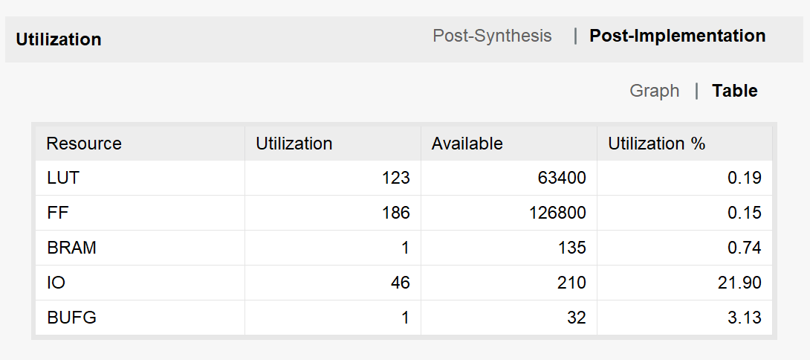
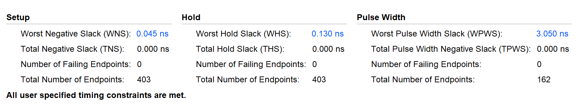

## Task 1
### Task 1-1
```Verilog
module Adder_LookAhead8_1_1 (
    input                   [ 7 : 0]            a, b,
    input                   [ 0 : 0]            ci,         // 来自低位的进位
    output                  [ 7 : 0]            s,          // 和
    output                  [ 0 : 0]            co          // 向高位的进位
);

wire    [7:0] C;
wire    [7:0] G;
wire    [7:0] P;

assign  G = a & b;
assign  P = a ^ b;

assign  C[0] = G[0] | ( P[0] & ci );
assign  C[1] = G[1] | ( P[1] & G[0] ) | ( P[1] & P[0] & ci );
assign  C[2] = G[2] | ( P[2] & G[1] ) | ( P[2] & P[1] & G[0] ) | ( P[2] & P[1] & P[0] & ci );
assign  C[3] = G[3] | ( P[3] & G[2] ) | ( P[3] & P[2] & G[1] ) | ( P[3] & P[2] & P[1] & G[0] ) | ( P[3] & P[2] & P[1] & P[0] & ci );
assign  C[4] = G[4] | ( P[4] & G[3] ) | ( P[4] & P[3] & G[2] ) | ( P[4] & P[3] & P[2] & G[1] ) | ( P[4] & P[3] & P[2] & P[1] & G[0] ) | ( P[4] & P[3] & P[2] & P[1] & P[0] & ci );
assign  C[5] = G[5] | ( P[5] & G[4] ) | ( P[5] & P[4] & G[3] ) | ( P[5] & P[4] & P[3] & G[2] ) | ( P[5] & P[4] & P[3] & P[2] & G[1] ) | ( P[5] & P[4] & P[3] & P[2] & P[1] & G[0] ) | ( P[5] & P[4] & P[3] & P[2] & P[1] & P[0] & ci );
assign  C[6] = G[6] | ( P[6] & G[5] ) | ( P[6] & P[5] & G[4] ) | ( P[6] & P[5] & P[4] & G[3] ) | ( P[6] & P[5] & P[4] & P[3] & G[2] ) | ( P[6] & P[5] & P[4] & P[3] & P[2] & G[1] ) | ( P[6] & P[5] & P[4] & P[3] & P[2] & P[1] & G[0] ) | ( P[6] & P[5] & P[4] & P[3] & P[2] & P[1] & P[0] & ci );
assign  C[7] = G[7] | ( P[7] & G[6] ) | ( P[7] & P[6] & G[5] ) | ( P[7] & P[6] & P[5] & G[4] ) | ( P[7] & P[6] & P[5] & P[4] & G[3] ) | ( P[7] & P[6] & P[5] & P[4] & P[3] & G[2] ) | ( P[7] & P[6] & P[5] & P[4] & P[3] & P[2] & G[1] ) | ( P[7] & P[6] & P[5] & P[4] & P[3] & P[2] & P[1] & G[0] ) | ( P[7] & P[6] & P[5] & P[4] & P[3] & P[2] & P[1] & P[0] & ci );

assign  s[0] = P[0] ^ ci;
assign  s[1] = P[1] ^ C[0];
assign  s[2] = P[2] ^ C[1];
assign  s[3] = P[3] ^ C[2];
assign  s[4] = P[4] ^ C[3];
assign  s[5] = P[5] ^ C[4];
assign  s[6] = P[6] ^ C[5];
assign  s[7] = P[7] ^ C[6];
assign  co   = C[7];

endmodule

module Adder32_1_1 (
    input                   [31 : 0]        a, b,
    input                   [ 0 : 0]        ci,
    output                  [31 : 0]        s,
    output                  [ 0 : 0]        co
);
wire    [2:0] cmid;
Adder_LookAhead8_1_1 adder8_0(
    .a(a[7:0]),
    .b(b[7:0]),
    .ci(ci),
    .s(s[7:0]),
    .co(cmid[0])
);
Adder_LookAhead8_1_1 adder8_1(
    .a(a[15:8]),
    .b(b[15:8]),
    .ci(cmid[0]),
    .s(s[15:8]),
    .co(cmid[1])
);
Adder_LookAhead8_1_1 adder8_2(
    .a(a[23:16]),
    .b(b[23:16]),
    .ci(cmid[1]),
    .s(s[23:16]),
    .co(cmid[2])
);
Adder_LookAhead8_1_1 adder8_3(
    .a(a[31:24]),
    .b(b[31:24]),
    .ci(cmid[2]),
    .s(s[31:24]),
    .co(co)
);

endmodule

module AddSub_1_1 (
    input                   [31 : 0]        a, b,
    output                  [31 : 0]        out,
    output                  [ 0 : 0]        co
);
Adder32_1_1 addsub(
    .a(a),
    .b(~b),
    .ci(1'b1),
    .s(out),
    .co(co)
);

endmodule

module Comp_1_1 (
    input                   [31 : 0]        a, b,
    output                  [ 0 : 0]        ul, // 无符号数比较
    output                  [ 0 : 0]        sl  // 有符号数比较
);

wire [31 : 0]   diff;
wire            sub_co;
AddSub_1_1 comp_sub(
    .a(a),
    .b(b),
    .out(diff),
    .co(sub_co)
);
assign sl = (a[31] ^ b[31]) ? (a[31] ? 1 : 0) : (diff[31] ? 1 : 0);
assign ul = ~sub_co;

endmodule

// 选择器
module Src1_1_1 (
    input                   [31 : 0]        a, b,
    output                  [31 : 0]        out
);

assign out = a;
endmodule

module ALU_1_1(
    input                   [31 : 0]        src0,
    input                   [31 : 0]        src1,
    input                   [3  : 0]        op,
    output                  [31 : 0]        res
);

wire        [12:0] sel = 13'b1 << op;

wire signed [31:0] signed_src0 = src0;

wire        [31:0] add_out;
wire        [31:0] sub_out;
wire        [0 :0] slt_out;
wire        [0 :0] sltu_out;
wire        [31:0] src1_out;

Adder32_1_1 alu_add(
    .a(src0),
    .b(src1),
    .ci(1'B0),
    .s(add_out),
    .co()
);

AddSub_1_1 alu_sub(
    .a(src0),
    .b(src1),
    .out(sub_out),
    .co()
);

Comp_1_1 alu_comp(
    .a(src0),
    .b(src1),
    .ul(sltu_out),
    .sl(slt_out)
);

Src1_1_1 alu_src1(
    .a(src0),
    .b(src1),
    .out(src1_out)
);

wire [31:0] and_out = src0 & src1;
wire [31:0] or_out  = src0 | src1;
wire [31:0] nor_out = ~(src0 | src1);
wire [31:0] xor_out = src0 ^ src1;
wire [31:0] sll_out = src0 << src1[4:0];
wire [31:0] srl_out = src0 >> src1[4:0];
wire [31:0] sra_out = signed_src0 >>> src1[4:0];

assign res = ({32{sel[ 0]}} & add_out          ) | 
             ({32{sel[ 1]}} & sub_out          ) |
             ({32{sel[ 2]}} & {31'b0, slt_out} ) |
             ({32{sel[ 3]}} & {31'b0, sltu_out}) |
             ({32{sel[ 4]}} & and_out          ) |
             ({32{sel[ 5]}} & or_out           ) |
             ({32{sel[ 6]}} & nor_out          ) |
             ({32{sel[ 7]}} & xor_out          ) |
             ({32{sel[ 8]}} & sll_out          ) |
             ({32{sel[ 9]}} & srl_out          ) |
             ({32{sel[10]}} & sra_out          ) |
             ({32{sel[11]}} & src1_out         );

endmodule
```
减法器的实现：根据 `-b = ~b + 1` 的补码转换规则，可得 `a - b = a + ~b + 1`，从而将减法转化为加法；同时注意可以利用低位进位输入 `ci` 置 1。

比较器的实现：
- 对于有符号小于比较，如果 `a, b` 的符号位不同，则符号位为 1 的那个数更小；若符号位相同，则根据 `diff = a - b` 的符号位进行判断，如果 `diff` 的符号位为 1，则 `a` 更小。
- 对于无符号小于比较，直接根据 `a - b` 的结果进位 `co` 进行判断，如果 `co` 为 1，说明 `a >= b`；否则则有 `a < b`。
    - 具体原理：`-b` 在本问题中等同于 `2^32 - b`，`a - b` 等同于 `a + 2^32 - b`（33 位下的结果）。如果 `a >= b`，说明第 33 位保持为 1（2^32 不会被拆散）；否则第 33 位为 0（`a - b` 不够减，向 2^32 位借位，2^32 被拆散）。
    - 所以 `co` 在这里实际上表示了借位情况，如果 `a >= b`，则 `co = 1`；否则 `co = 0`。
- 另一个需要注意的点：比较器的输出只有 1 位，需要将其先扩展到 32 位再赋值给 `res`。

循环右移的实现：
- 把结果分两部分考虑：一部分是右移到低位但没有循环到最高位的部分（`A`）；另一部分是右移出最低位并回到最高位的部分（`B`）。
- 对于 `A`，只需要执行 `a >> b[4:0]` 即为其答案（由于循环右移 32 位之后 `a` 不变，因此 `b[31:5]` 的取值不会对结果产生任何影响）；
- 对于 B，它出现在最高位等价于在原数中将 `B` 左移 `32 - b[4:0]` 位的结果。
- 最后将 `A, B` 按位取或即为最终的循环右移结果。

`res` 赋值时根据独热码 `sel` 每一位上的取值来选择最终的结果。

### Task 1-2
```Verilog
module  RF (
    input       [0 : 0]         clk     ,       // 时钟
    input       [4 : 0]         ra0, ra1,       // 读地址
    output  reg [31: 0]         rd0, rd1,       // 读数据
    input       [4 : 0]         wa      ,       // 写地址
    input       [31: 0]         wd      ,       // 写数据
    input       [0 : 0]         we              // 写使能
);
reg [31:0] r[0:31];     // 寄存器堆

// 初始化所有寄存器为 0
integer i;
initial begin
    for (i = 0; i < 32; i = i + 1) begin
        r[i] = 0;
    end
end

// 读寄存器；写优先，同步
always @(posedge clk) begin
    if (we && ra0 != 0 && ra0 == wa) // 写优先：如果读写同一地址且非 0 号寄存器
        rd0 <= wd;
    else
        rd0 <= r[ra0];
    
    if (we && ra1 != 0 && ra1 == wa)
        rd1 <= wd;
    else
        rd1 <= r[ra1];
end

// 写寄存器（同步）
always  @(posedge clk)
    if (we && wa != 0)  // 只有写使能有效且地址非 0 时才写入
        r[wa] <= wd;
endmodule
```
寄存器实现写优先的思路：在读操作时，如果读地址与写地址相同且写使能有效，则优先返回写数据而不是寄存器中的旧数据。

为了让寄存器堆的输出数据流更规整，采用同步读取方式实现寄存器堆，只在时钟上升沿读取寄存器堆中的数据并更新到输出端口。如果输入的地址信息维持没有达到一个时钟周期，则会被寄存器堆忽略。

## Task 2
本任务使用的 testbench 文件如下：
```Veriog
`timescale 1ns / 1ps

module memory_compare_tb();
    reg clk;
    reg we;
    reg [9:0] addr;
    reg [31:0] din;
    wire [31:0] dout_dist;          // Distributed RAM 的输出
    wire [31:0] dout_block_wfirst;  // 写优先 BRAM 的输出
    wire [31:0] dout_block_rfirst;  // 读优先 BRAM 的输出    

    // 实例化 Distributed RAM
    dist_mem_gen_0 dist_mem (
        .a(addr), .d(din), .clk(clk), .we(we), .spo(dout_dist)
    );

    // 实例化 Block RAM（写优先）
    blk_mem_gen_0 blk_mem_wfirst (
        .clka(clk), .wea(we), .addra(addr), .dina(din), .douta(dout_block_wfirst)
    );

    // 实例化 Block RAM（读优先）
    blk_mem_gen_1 blk_mem_rfirst (
        .clka(clk), .wea(we), .addra(addr), .dina(din), .douta(dout_block_rfirst)
    );

    always #5 clk = ~clk;

    initial begin
        clk = 0; we = 0; addr = 0; din = 0;
        #20;

        // 向目标地址 10 写入数据 0xABCD1234（同步）
        @(posedge clk); // 等待时钟上升沿（对齐）
        addr = 10'd10; din = 32'hABCD1234; we = 1;
        @(posedge clk); // 该上升沿 Distributed RAM 写入新值并立即读出新值
        @(posedge clk); // 该上升沿 BRAM 写入新值，写优先 BRAM 读出新值
        @(posedge clk); // 该上升沿读优先 BRAM 读出新值
        #5;
        we = 0;

        #10;
        // 在目标地址不变的情况下，写入新数据
        @(posedge clk);
        din = 32'h1234ABCD; we = 1;
        @(posedge clk); // 该上升沿 Distributed RAM 写入新值并立即读出新值
        @(posedge clk); // 该上升沿 BRAM 写入新值，写优先 BRAM 读出新值
        @(posedge clk); // 该上升沿读优先 BRAM 读出新值
        #5;
        we = 0;

        // 改变目标地址到 0
        @(posedge clk);
        #5;
        addr = 10'd0; // distributed RAM 立即读出新值
        @(posedge clk); // 该上升沿两种 BRAM 仍未读出新值
        @(posedge clk); // 该上升沿两种 BRAM 同时读出新值
        
        
        #20 $finish;
    end
endmodule
```
在仿真波形中看到，在一个时钟上升沿尝试写入的同时读数据时，Distributed RAM 在下一个上升沿读出新值，写优先的 BRAM 在下两个上升沿读出新值，读优先的 BRAM 在下三个上升沿读出新值；当只做读取数据的操作时，Distributed RAM 立即读出新值，BRAM 在下两个上升沿读出新值。
- 当 BRAM 端口设置中的 `Primitives Output Register` 开关被关闭时，两种 BRAM 的时序均**提前一个时钟周期**，即：同时读写时写优先的 BRAM 在下一个上升沿读出新值，读优先的 BRAM 在下两个上升沿读出新值；仅读取时，BRAM 在下一个上升沿读出新值。

Distributed RAM 的读取基于纯粹的组合逻辑，因此可以即时响应任何时候的仅读取请求。对于同时读写的请求，由于 Distributed RAM 采用异步读取、同步写入，因此在当前上升沿新数据即被写入，并通过一个时钟周期的稳定过程后被读出。

打开 `Primitives Output Register` 开关时，BRAM 为了保证在高工作频率下仍能满足建立/保持时间要求，在时序上表现出多周期的潜伏期（具体来说，在本实验的仿真中体现为 2 个时钟周期）。在第一个时钟上升沿，BRAM 主要完成**完成输入信号的采样与同步**，当系统时钟的上升沿到来时，块式存储器的输入端寄存器会将外部总线上的地址、写使能信号以及待写入的数据同步捕获到内部逻辑中。第二个时钟上升沿 BRAM 仍未读出，与 BRAM 为了隔离关键路径而设置数据输出流水线有关。内部核心阵列在第一个时钟周期内完成数据访问后，该数据会被送至输出端，并在第二个时钟上升沿被**输出寄存器**稳定锁存，随后才真正呈现在外部数据总线上。因此，在仅读取请求中，两种 BRAM 都在第二个上升沿处读出新值，而在同时读写请求中，写优先 BRAM 在第二个上升沿处读出新值，读优先 BRAM 在第三个上升沿处读出新值（还需要经过一个时钟周期才能读取新写入该地址的值）。

## Task 3
### Task 3-1
```Verilog
`timescale 1ns / 1ps

// ========================================================
// 真双端口 BRAM（读优先）
// ========================================================
module dual_port_bram #(
    parameter DATA_WIDTH = 32,
    parameter ADDR_WIDTH = 10
)(
    input  wire                  clk,
    // 端口 A
    input  wire                  wea,
    input  wire [ADDR_WIDTH-1:0] addra,
    input  wire [DATA_WIDTH-1:0] dina,
    output reg  [DATA_WIDTH-1:0] douta,
    // 端口 B
    input  wire                  web,
    input  wire [ADDR_WIDTH-1:0] addrb,
    input  wire [DATA_WIDTH-1:0] dinb,
    output reg  [DATA_WIDTH-1:0] doutb
);

    // 定义存储器，深度 1024
    reg [DATA_WIDTH-1:0] ram [0:(1<<ADDR_WIDTH)-1];

    initial begin
        // 使用 .txt 文件进行初始化
        $readmemh("E:/Computer-Organization-and-Design-26SP/Labs/Lab1/Task3/attachments/data.txt", ram);
    end

    // 端口 A 同步读写
    always @(posedge clk) begin
        if (wea)
            ram[addra] <= dina;
        douta <= ram[addra];
    end

    // 端口 B 同步读写
    always @(posedge clk) begin
        if (web)
            ram[addrb] <= dinb;
        doutb <= ram[addrb];
    end
endmodule


// ========================================================
// 冒泡排序主模块 SRT
// ========================================================
module SRT (
    input  wire        clk,
    input  wire        rstn,
    input  wire        mode,      // 0-降序，1-升序
    input  wire        start,     // 启动信号
    input  wire [9:0]  addr,      // 查看地址（基于开关输入）

    output reg         done,      // 排序结束标志
    output wire [31:0] data,      // addr 对应地址上的数据
    output reg  [31:0] count      // 排序所需时钟周期数
);

    // --------------------------------------------------------
    // BRAM 接口信号定义
    // --------------------------------------------------------
    reg  [9:0]  bram_addra, bram_addrb;
    reg  [31:0] bram_dina,  bram_dinb;
    reg         bram_wea,   bram_web;
    wire [31:0] bram_douta, bram_doutb;

    // 实例化 BRAM
    dual_port_bram #(
        .DATA_WIDTH(32),
        .ADDR_WIDTH(10)
    ) bram (
        .clk   (clk),
        .wea   (bram_wea),
        .addra (bram_addra),
        .dina  (bram_dina),
        .douta (bram_douta),

        .web   (bram_web),
        .addrb (bram_addrb),
        .dinb  (bram_dinb),
        .doutb (bram_doutb)
    );

    // 查看地址功能映射：空闲或完成时，利用端口 A 读取外部开关指定的地址
    assign data = bram_douta;

    // --------------------------------------------------------
    // 状态机定义
    // --------------------------------------------------------
    localparam S_IDLE  = 3'd0; // 空闲/等待
    localparam S_READ  = 3'd1; // 发送读地址
    localparam S_RWAIT = 3'd2; // 等待 BRAM 同步读取延迟（1 个周期）
    localparam S_CMP   = 3'd3; // 比较数据，决定是否交换
    localparam S_WRITE = 3'd4; // 写入交换后的数据
    localparam S_WWAIT = 3'd5; // 等待 BRAM 写入，提高电路稳定性
    localparam S_DONE  = 3'd6; // 排序完成

    reg [2:0] current_state, next_state;

    reg [9:0] i;       // 外循环: 0 到 1022
    reg [9:0] j;       // 内循环: 1023 到 i + 1

    // --------------------------------------------------------
    // 主控时序逻辑
    // --------------------------------------------------------
    always @(posedge clk or negedge rstn) begin
        if (!rstn) begin
            current_state   <= S_IDLE;
            i               <= 0;
            j               <= 1023;
            count           <= 0;
            bram_wea        <= 0;
            bram_web        <= 0;
            bram_addra      <= 0;
            bram_addrb      <= 0;
            bram_dina       <= 0;
            bram_dinb       <= 0;
        end 
        else begin
            current_state <= next_state;
            case (current_state)
                S_IDLE: begin
                    bram_wea <= 0;
                    bram_web <= 0;

                    // 在空闲状态，将端口 A 开放给拨码开关以便查看数据
                    bram_addra <= addr;
                    
                    if (start) begin    // 检测到开始排序信号，把所有排序中使用的辅助变量初始化
                        i     <= 0;
                        j     <= 1023;
                        count <= 0;
                    end
                end

                S_READ: begin
                    count <= count + 1;
                    bram_wea <= 0;
                    bram_web <= 0;
                    // 发送相邻两个数据的地址给 BRAM 端口 A 和 B
                    bram_addra <= j - 1;
                    bram_addrb <= j;
                end

                S_RWAIT: begin   // 缓冲 1 个时钟周期，等待 BRAM 将数据推送到 douta 和 doutb
                    count <= count + 1;
                end

                S_CMP: begin    // douta 和 doutb 数据就绪，比较两个位上的数据大小
                    count <= count + 1;
                    if ((mode == 1'b1 && bram_douta > bram_doutb) || 
                        (mode == 1'b0 && bram_douta < bram_doutb)) begin
                        // 需要交换：将读出的数据交叉写回
                        bram_addra <= j - 1;
                        bram_dina  <= bram_doutb; 
                        bram_wea   <= 1;

                        bram_addrb <= j;
                        bram_dinb  <= bram_douta;
                        bram_web   <= 1;
                    end
                    else begin
                        // 不需要交换，直接跳转到下一个元素
                        if (j > i + 1) begin
                            j <= j - 1;
                        end
                        else begin
                            if (i < 1022) begin
                                i <= i + 1;
                                j <= 1023;
                            end
                        end
                    end
                end

                S_WRITE: begin
                    count <= count + 1;
                    // 写入只需一个周期，立刻关闭写使能
                    bram_wea <= 0;
                    bram_web <= 0;
                end

                S_WWAIT: begin
                    count <= count + 1;

                    // 索引跳转逻辑
                    if (j > i + 1) begin
                        j <= j - 1;
                    end
                    else begin
                        if (i < 1022) begin
                            i <= i + 1;
                            j <= 1023;
                        end
                    end
                end

                S_DONE: begin
                    // 排序完成后，再次将端口 A 开放给拨码开关以查看数据
                    bram_addra <= addr;
                end
            endcase
        end
    end

    // --------------------------------------------------------
    // 状态转换组合逻辑
    // --------------------------------------------------------
    always @(*) begin
        next_state = current_state;
        case (current_state)
            S_IDLE:
                if (start)
                    next_state = S_READ;
                else
                    next_state = S_IDLE; 
            S_READ: // 从内存中读取，直接跳转到 WAIT 状态等待一个时钟周期
                next_state = S_RWAIT;
            S_RWAIT: // 等待一个时钟周期后读取完毕，跳转到 CMP 状态
                next_state = S_CMP;
            S_CMP:
                if ((mode == 1'b1 && bram_douta > bram_doutb) ||    // 升序情况下(1)，前面的数比后面的数更大
                    (mode == 1'b0 && bram_douta < bram_doutb))      // 降序情况下(0)，前面的数比后面的数更小
                    next_state = S_WRITE;                           // 需要进行数据交换
                else begin  // 否则，直接进行下一轮比较
                    if (j > i + 1 || i < 1022)   // 完整一轮的比较仍未结束，或者后面还有新的一轮比较需要进行
                        next_state = S_READ;
                    else                            // 比较完成
                        next_state = S_DONE;
                end
            S_WRITE:
                next_state = S_WWAIT;
            S_WWAIT:
                if (j > i + 1 || i < 1022)   // 完整一轮的比较仍未结束，或者后面还有新的一轮比较需要进行
                    next_state = S_READ;
                else                            // 比较完成
                    next_state = S_DONE;
            S_DONE: begin
                next_state = S_IDLE;
            end
            default:    // 对于其它非法状态，直接跳转到 IDLE
                next_state = S_IDLE;
        endcase
    end

    // --------------------------------------------------------
    // 输出逻辑
    // --------------------------------------------------------
    always @(*) begin
        done = (current_state == S_DONE);
    end

endmodule
```
在本任务的实现中，使用自行创建的读优先双端口读写 BRAM。

排序模块中，设计的状态机包括 `IDLE`、`READ`、`RWAIT`、`CMP`、`WRITE`、`WWAIT`、`DONE` 等状态。复位后，状态机默认处于 `IDLE` 状态。

在排序过程中使用了两个临时变量用于指示当前的排序状态。外层循环 `i` 从 0 递增到 1022（`i` 以前的数据已经有序），内层循环 `j` 从 1023 递减到 `i + 1`（把当前最大 / 小的数据移动到有序区段末尾），每次比较相邻两个元素并根据排序模式决定是否交换。

状态机的具体转换流程如下：
1. 在 `IDLE` 状态，状态机将 BRAM 端口 A 开放给外部拨码开关，以便用户查看任意地址上的数据。当检测到 `start` 信号有效时，状态机初始化循环变量 `i = 0` 和 `j = 1023`，并跳转到 `READ` 状态开始排序。
2. 在 `READ` 状态，状态机通过 BRAM 的两个端口分别发送地址 `j - 1` 和 `j`，准备读取相邻的两个数据元素。地址发送完成后，立即跳转到 `RWAIT` 状态。
3. BRAM 采用同步读取方式，需要一个时钟周期的延迟才能将数据稳定输出到 `douta` 和 `doutb` 端口。因此，状态机在 `RWAIT` 状态等待一个时钟周期，等待输出端口的数据稳定后，再跳转到 `CMP` 状态进行数据比较。
4. 在 `CMP` 状态，排序模块根据排序模式 `mode` 对读取的两个数据进行比较：
   - 若 `mode = 1`（升序）且 `douta > doutb`，或 `mode = 0`（降序）且 `douta < doutb`，则需要交换两个数据，跳转到 `WRITE` 状态；
   - 否则，不需要交换。若此时比较仍未结束（`j > i + 1` 或 `i < 1022`），则更新索引并跳转回 `READ` 状态继续下一轮比较；若所有比较已完成，则跳转到 `DONE` 状态。
5. 在 `WRITE` 状态，状态机将两个数据交叉写回 BRAM 的对应地址（`doutb` 写入地址 `j - 1`，`douta` 写入地址 `j`），并在写入完成后关闭写使能信号，跳转到 `WWAIT` 状态。
6. 为了提高电路稳定性，状态机在 `WWAIT` 状态等待一个时钟周期，确保数据已稳定写入 BRAM。之后根据循环索引判断下一步的跳转：
   - 若比较仍未结束（`j > i + 1` 或 `i < 1022`），则更新索引并跳转回 `READ` 状态；
   - 若所有比较已完成，则跳转到 `DONE` 状态。
7. 在 `DONE` 状态时，状态机将 `done` 信号置为有效，并将 BRAM 端口 A 再次开放给外部拨码开关以便查看排序后的数据。之后立即跳转回 `IDLE` 状态，等待下一次排序请求。

### Task 3-2
LUT、FF 等资源的使用情况如下图：


经过测试，当时钟周期为 $7.1\,\text{ns}$ 时，WNS 达到 $0.045\,\text{ns}$，故电路正常工作的最高时钟频率约为 $141.7\,\text{MHz}$。

