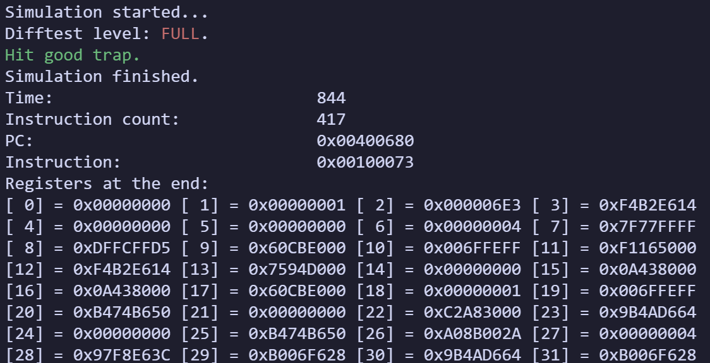
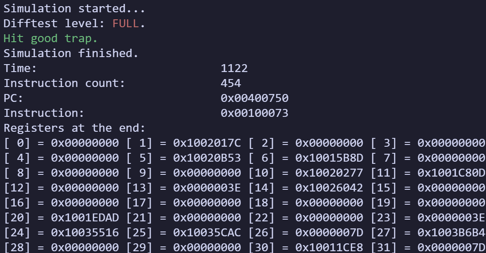
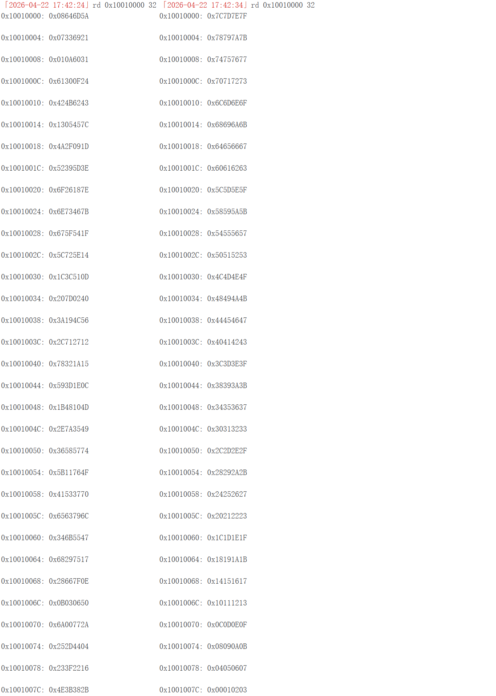
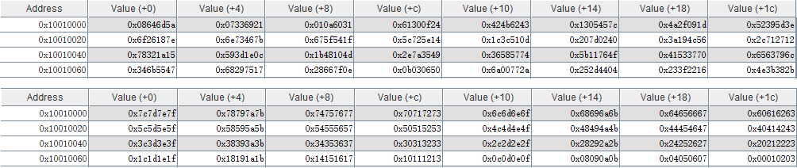
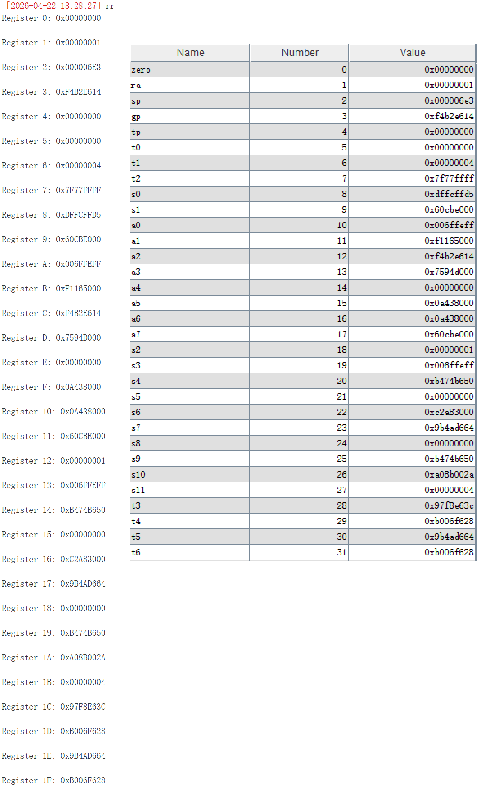
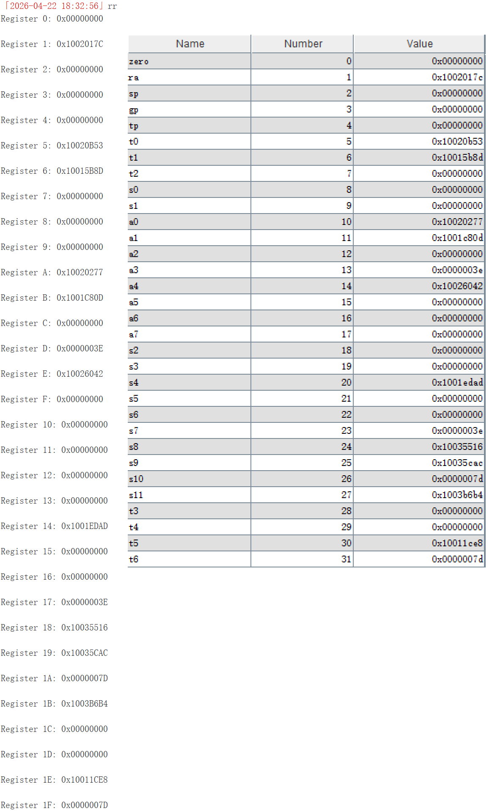

### 一、代码结构简要描述

本实验在单周期 CPU 的基础上，实现了**32 位五级流水线 RISC-V CPU**。相较于单周期代码，主要模块按功能划分如下：
- `cpu.v`：流水线 CPU 顶层模块，通过四组段间流水线寄存器（`IF/ID`、`ID/EX`、`EX/MEM`、`MEM/WB`）将指令执行划分为五个流水段；内部整合了数据通路模块，并加入处理数据冒险和控制冒险的**前递模块**（Forwarding Unit）与**Load-Use 冒险和控制冒险处理单元**（Hazard Detection Unit）；对外开放连接指令/数据内存的 I/O 端口。
- `pipe_reg.v`（`seg_reg`）：段间寄存器模块。用于在时钟沿受 `en` 控制来锁存上一流水段计算出的所有数据或控制信号，并向后传递。支持通过 `stall`（停顿，保持输出不变）和 `flush`（清空，输出清零注入气泡）来响应流水线冒险停顿机制。
- `decoder.v`：移至 **ID 段**的纯组合译码器，在指令开始译码阶段时即集中生成供本段及后续 EX、MEM、WB 段使用的各项控制信号（如 `alu_op`、`mem_read`/`mem_write`、`wb_sel` 等）。因条件流向决策转移至 EX 段判断，流水线移除了原来的 `pc_sel` 信号直出。
- `regfile.v`：异步读同步写的 32x32 寄存器堆，含 debug 只读端口开放给外层 PDU 模块用于随时读取各个寄存器状态。
- `alu.v` 与 `cmp.v`：位于 **EX 段**的核心计算模块，除执行算术逻辑运算以外，在此级直接计算分支条件 `cmp_res` 以用于动态控制后续取指路径（决定 `pc_sel_EX`）。
- `data_mem_ctrl.v`：位于 **MEM 段**的数据访存控制器，与单周期功能一致，利用内部遮罩处理非整字对齐读写带来的错位合并难题。
- `imm_gen.v`：位于 **ID 段**，根据指令类型拼接生成对应立即数。

### 二、指令执行的数据通路

在流水线 CPU 中，指令的生命周期依次分为五段：
1. **取指 (IF - Instruction Fetch)**：从 PC 中读取下一条指令地址，并在下一个时钟上升沿根据 `next_pc` 更新 `pc_reg`。
    - 若未触发 Load-Use 冒险且不是跳转指令，PC 更新为 `PC+4`；若 `EX` 段判定跳转（`pc_sel_EX=1`），则更新为跳转目标地址；若触发 Load-Use 冒险（`pc_stall=1`），则保持原值不变。
2. **译码与寄存器读 (ID - Instruction Decode)**：从 `IF/ID` 段间寄存器取出的指令传入 `decoder` 和 `imm_gen`，获得立即数和各类控制信号；寄存器读取 `rs1/2` 指示的寄存器中存储的值（具体结果取决于数据冒险情况，由一个 MUX 控制最终有效输出）。
3. **执行 (EX - Execute)**：结合 `ID/EX` 段间寄存器输入和前递、冒险处理机制执行指令的主要运算过程。
   - 若源操作数存在对此前指令执行结果的依赖（RAW 相关），则依据 `forward_a`/`forward_b` 指示，用处在 `EX/MEM` 或 `MEM/WB` 段间寄存器中的待写入寄存器数值取代在 `ID` 段读出的寄存器过期值作为 ALU 运算数。
   - 若 `branch`/`jalr` 跳转条件成立，则清空与错误执行指令相关的 `IF/ID` 段间寄存器和 `ID/EX` 段间寄存器。
4. **访存 (MEM - Memory Access)**：对于 `load`/`store` 指令，通过 `EX/MEM` 段间寄存器提供的访存地址和写入值与内存进行 I/O 交互。
5. **写回与 PC 更新 (WB - Write Back)**：利用 `MEM/WB` 段间寄存器提供的指令执行结果，通过 `wb_sel` 信号选择 ALU 计算结果、访存值或 `PC+4` 写入指定的寄存器。

### 三、流水线改造总述
从单周期 CPU 向流水线 CPU 的改造主要包括以下内容：
1. **引入段间寄存器**：将数据通路拆分为 `IF/ID/EX/MEM/WB` 五个阶段，在每两段之间插入段间寄存器，用于锁存并传递下个段所需的控制信号和数据
  - 以通用单个段间寄存器模块 `pipe_reg` 为基础，构建**传递所有可能使用到的段间数据和信号**的段间寄存器模块 `seg_reg`
  - 对于每个段间寄存器，例化一个 `seg_reg` 模块，对于在下个段不会使用到的数据和信号，在其输入端口直接接 `0`
```Verilog
module pipe_reg #(
    parameter WIDTH = 32  // 默认宽度 32 位
)(
    input  wire             clk,
    input  wire             rst,        // 同步清空，连到 CPU 的 rst 信号
    input  wire             en,         // 受 PDU 控制，连到 global_en
    input  wire             stall,      // 停驻，高电平时输出保持不变
    input  wire             flush,      // 同步清空，高电平时段间寄存器 data_out 清空
    input  wire [WIDTH-1:0] data_in,    // 待写入数据
    output reg  [WIDTH-1:0] data_out    // 输出数据
);

    always @(posedge clk) begin
        if (rst) begin              // 同步清空
            data_out <= {WIDTH{1'b0}};
        end
        else if (en) begin          // en 信号有效，先处理 flush 信号，再处理 stall 信号
            if (flush) begin        // flush 信号有效，清空输出
                data_out <= {WIDTH{1'b0}};
            end
            else if (!stall) begin  // 如果没有有效 stall 信号，就正常更新段间寄存器
                data_out <= data_in;
            end
            // 如果 stall 有效，则保持原值不变
        end
    end

endmodule
```
2. **前递**：引入前递模块（Forwarding Unit）解决数据冒险
    - `ID` 段：寄存器堆的写回数据可以在同一周期被 `ID` 阶段读取（`WB/ID` 前递，与 `forwarded_rf_rdata1/2_ID` 有关）。当 `WB` 阶段正在写入的目标寄存器恰好是 `ID` 阶段指令需要读取的源寄存器时，直接将待写回的数据（`rf_wdata_WB`）转发给 `ID` 阶段作为译码输出，以此解决同一时钟周期内读写同一寄存器可能导致的暂态/旧值读取问题。
    ```Verilog
    assign forwarded_rf_rdata1_ID = (rf_we_WB && rd_WB != 5'd0 && rs1_ID == rd_WB) ? 
                                    rf_wdata_WB : rf_rdata1_ID;
    
    assign forwarded_rf_rdata2_ID = (rf_we_WB && rd_WB != 5'd0 && rs2_ID == rd_WB) ? 
                                    rf_wdata_WB : rf_rdata2_ID;
    ```
    - `EX` 段：在 `MEM` 段或 `WB` 段确定的寄存器堆写回数据可以在同一周期被 `EX` 阶段读取（`MEM/EX` 前递或 `WB/EX` 前递，与 `forwarded_rdata1/2_EX` 有关）。如果发生了 RAW 数据相关，`forwarded_rdata1/2_EX` 将使用 `rf_wdata_MEM` 或 `rf_wdata_WB` 作为 ALU 的操作数输入（使用 `forward_a/b` 控制信号进行选择）。
    ```Verilog
    assign forward_a = (rf_we_MEM && rd_MEM != 5'd0 && rd_MEM == rs1_EX) ? 2'b10 :
                       (rf_we_WB && rd_WB != 5'd0 && rd_WB == rs1_EX) ? 2'b01 : 2'b00;

    assign forward_b = (rf_we_MEM && rd_MEM != 5'd0 && rd_MEM == rs2_EX) ? 2'b10 :
                       (rf_we_WB && rd_WB != 5'd0 && rd_WB == rs2_EX) ? 2'b01 : 2'b00;

    assign forwarded_rdata1_EX = (forward_a == 2'b10) ? rf_wdata_MEM :
                                 (forward_a == 2'b01) ? rf_wdata_WB  :
                                 rf_rdata1_EX;

    assign forwarded_rdata2_EX = (forward_b == 2'b10) ? rf_wdata_MEM :
                                 (forward_b == 2'b01) ? rf_wdata_WB  :
                                 rf_rdata2_EX;
    ```
3. **Load-Use 冒险、控制冒险处理**：引入冒险检测逻辑（Hazard Detection）解决 Load-Use 冒险和控制冒险。
4. 其它修改
    - 删除了译码器中的 `pc_sel` 信号输出：在流水线 CPU 中，`EX` 段进行分支条件判断，因此 PC 跳转信号在 `EX` 段才能给出
    - 在 `IF` 段，PC 更新过程 `pc_reg <= next_pc` 受 `pc_stall` 信号控制；`next_pc` 的值受到 `EX` 段 `pc_sel_EX` 信号（与**分支跳转指令**相关）影响
    ```Verilog
    if (global_en && !pc_stall) begin
        pc_reg <= next_pc;
    end
    ```

### 四、前递模块实现
前递模块主要解决 **`EX` 段数据冒险**，即后面指令的源操作数依赖于前面尚未写回寄存器堆但已在流水线中计算出的结果。

**实现逻辑：**
-   **`MEM/EX` 前递**：当 `MEM` 段指令（即 `EX` 段指令的上一条指令）需要写回寄存器（`rf_we_MEM`），且目标寄存器 `rd_MEM` 与当前 `EX` 段指令的源寄存器 `rs1/2_EX` 相同时，直接将 `rf_wdata_MEM`（ALU 计算结果）旁路回 `EX` 段参与计算。
-   **`WB/EX` 前递**：当 `WB` 段指令（即 `EX` 段指令的上两条指令）需要写回寄存器（`rf_we_WB`），且目标寄存器 `rd_WB` 与当前 `EX` 段源寄存器相同时，将 `rf_wdata_WB` 旁路回 `EX` 段。
-   **优先级**：`MEM/EX` 前递优先级高于 `WB/EX` 前递，从而保证指令能获取到理论正确的寄存器读出值。
```Verilog
assign forward_a = (rf_we_MEM && rd_MEM != 5'd0 && rd_MEM == rs1_EX) ? 2'b10 :
                       (rf_we_WB && rd_WB != 5'd0 && rd_WB == rs1_EX) ? 2'b01 : 2'b00;
assign forward_b = (rf_we_MEM && rd_MEM != 5'd0 && rd_MEM == rs2_EX) ? 2'b10 :
                    (rf_we_WB && rd_WB != 5'd0 && rd_WB == rs2_EX) ? 2'b01 : 2'b00;

assign forwarded_rdata1_EX = (forward_a == 2'b10) ? rf_wdata_MEM :
                             (forward_a == 2'b01) ? rf_wdata_WB  :
                             rf_rdata1_EX;
assign forwarded_rdata2_EX = (forward_b == 2'b10) ? rf_wdata_MEM :
                                 (forward_b == 2'b01) ? rf_wdata_WB  :
                                 rf_rdata2_EX;
```

### 五、控制冒险与停顿模块实现
该模块负责处理**Load-Use 冒险**（由于**时序错位**导致，无法通过前递解决）和**控制冒险**（跳转与分支指令导致已进入流水线的部分指令无效）。

#### 1. Load-Use 冒险
- **发生时机**：当处于 `EX` 段的指令为 `load` (即 `mem_read_EX` 信号为 1)，且写入目标寄存器 `rd_EX` 刚好是其后正处于 `ID` 段的指令需要读取的源寄存器 `rs1/2_ID` 时，产生 Load-Use 冒险；`load` 指令读取的数据必须等到 `MEM/WB` 段间才能保证稳定获取，因此 `ID` 段指令必须停顿一个时钟周期等待。
- **判定逻辑**：
  仅简单判断 `rd_EX == rs1_ID || rd_EX == rs2_ID` 会导致冗余停顿问题：`rs1/2` 字段的提取**不依赖于具体指令类型**（如 I 型算术逻辑运算指令仍然会提取出没有实际意义的 `rs2` 字段）。为避免这一问题拉低流水线 CPU 性能，在实际采用的精确检测逻辑中，不仅需要检测访存动作、目标寄存器不为 `x0`，还需要**结合译码信息验证寄存器读操作确实产生数据依赖**：
  - 对于 `rs1`，判断 ALU-A 端口数据是否来自寄存器堆（`!alu_src_a_ID`）或用于分支比较（`is_branch_ID`）
  - 对于 `rs2`，判断 ALU-B 端口数据是否来自寄存器堆（`!alu_src_b_ID`）、用于分支比较，或作为 `store` 指令的待写入数据（`is_store_ID`）
  ```Verilog
  wire is_branch_ID = (opcode_ID == 7'b1100011);
  wire is_store_ID  = (opcode_ID == 7'b0100011);
  wire load_use_hazard = mem_read_EX && (rd_EX != 5'd0) 
                     && ((rd_EX == rs1_ID && (!alu_src_a_ID || is_branch_ID))
                     ||  (rd_EX == rs2_ID && (!alu_src_b_ID || is_branch_ID || is_store_ID)));
  ```
- **处理动作**：
  若检测到 Load-Use 冒险（`load_use_hazard = 1`），则设置以下信号
  - `pc_stall = 1`：**阻止 PC 更新**，当前 IF 段不进行新指令的取指；
  - `if_id_stall = 1`：**暂停 `IF/ID` 段间寄存器更新**，锁存住需要此依赖数据的指令；
  - `id_ex_flush = 1`：**清空 `ID/EX` 段间寄存器**，向流水线 `EX` 段推入气泡（**置空控制信号**），消耗一个时钟周期的等待时间。
```Verilog
wire is_branch_ID = (opcode_ID == 7'b1100011);
wire is_store_ID  = (opcode_ID == 7'b0100011);

wire load_use_hazard = mem_read_EX && (rd_EX != 5'd0) 
                    && ((rd_EX == rs1_ID && (!alu_src_a_ID || is_branch_ID))
                    ||  (rd_EX == rs2_ID && (!alu_src_b_ID || is_branch_ID || is_store_ID)));
```

#### 2. 控制冒险
- **发生时机**：在当前流水线设计中，`branch` 指令的分支条件判断结果和跳转目标地址的计算均位于 `EX` 阶段。当跳转分支成立时，紧随其后的两条指令分别位于 `ID` 段和 `IF` 段，这两条循序取回的指令属于*非预期执行指令*，需要清除
- **判定逻辑**：
  如果在 `EX` 段确定 `branch` 指令的分支跳转成立或者是无条件跳转指令，流水线下周期将会更新 PC 为目标地址（`pc_sel_EX = 1`，由此得到 `control_hazard = pc_sel_EX`）。
- **处理动作**：
  若检测为控制冒险（`control_hazard = 1`）：
  - `if_id_flush = 1`：清除 `IF/ID` 段间寄存器内容
  - `id_ex_flush = 1`：清除 `ID/EX` 段间寄存器内容
  在下一时钟周期，PC 已更新为跳转目标地址，因此**只需要清除两个非预期指令对应的流水段数据**即可。
```Verilog
wire control_hazard = pc_sel_EX;

wire pc_stall    = load_use_hazard;
wire if_id_stall = load_use_hazard;
wire if_id_flush = control_hazard;
wire id_ex_flush = load_use_hazard || control_hazard
```

### 六、实现效果演示
#### 仿真运行
使用 `lab4_test1.asm` 测试程序（无 Load-Use 的测试）在仿真框架上运行的结果如下：

使用 `lab4_test2.asm` 测试程序（完整测试）在仿真框架上运行的结果如下：

#### 上板运行冒泡排序程序
**上板运行**降序冒泡排序程序（详见 `Labs/Lab2/Task2/task2.asm`）前后，查看数据段内存如图所示：

**在 rars 上运行**同样的冒泡排序程序前后，查看数据段内存如图所示：

#### 上板运行测试程序（`lab4_test1/2.asm`）
**上板运行**和**在 rars 上**运行 `lab4_test1.asm` 后，读取 32 个寄存器结果如图所示：


**上板运行**和**在 rars 上**运行 `lab4_test2.asm` 后，读取 32 个寄存器结果如图所示：

