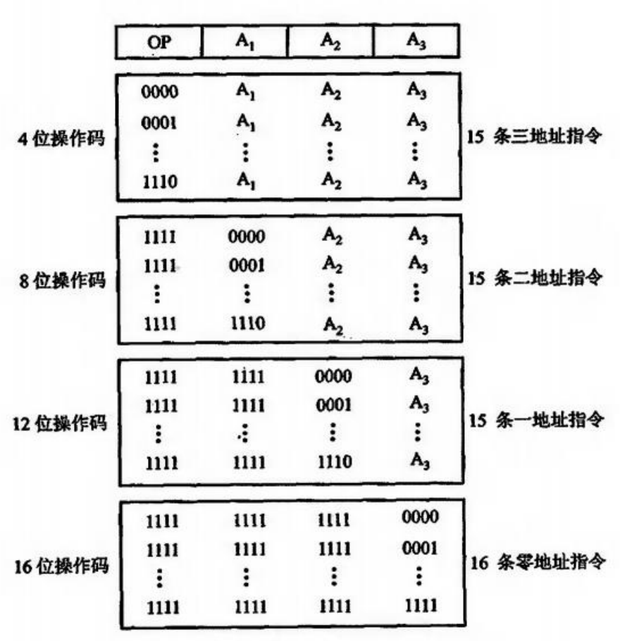

## 2-指令系统
指令：硬件和软件的接口
- 微指令：微程序级的命令（硬件）
- 宏指令：若干条机器指令组成的命令（软件）
- 机器指令：可完成一个独立的算术运算或逻辑运算操作
- 指令系统：一台计算机所有指令的集合

兼容性
- 向上（下）兼容：性能高低的问题
- 向前（后）兼容：发布时间前后的问题

为什么可以精简指令集？“二八定律”
- 如 x86 指令集执行数量前 10 的指令调用次数占 96%

评价一个指令集
- 完备性：指令足够，功能不需要用软件实现（乘法指令？）
- 有效性：指令集程序占存储空间小
  - 一条指令的长度需要多长？太短的指令长度，能承接的指令数少，能访问的地址域短
  - 访存效率如何？执行效率如何？
- 规整性：对称性、匀齐性、指令格式与数据格式的一致性（变长指令？定长指令？）
  - 变长指令：如 x86 指令集
    - 利于扩展指令集
    - 节省指令空间，较紧凑
    - 可以根据参数量灵活定制指令结构（如 `push/pop` 指令较短，`mov` 指令较长）
    - 可能需要多次取址操作（需要判断，实现难度较大）
  - 定长指令：如 ARM 指令集（精简指令集 RISC）
    - 利于取址、译码
- 兼容性：向上兼容、向前兼容

---
### 指令格式
操作码：固定长度/可变长度
- 扩展操作码技术：
- 设计变长操作码时，使用频率越高的指令应该占用越短的操作码

按操作数的物理位置的指令分类
- 存储器-存储器（SS），操作数全在主存中
- 寄存器-寄存器（RR），操作数都存放在 CPU 的寄存器中
  - 取操作数的时间延迟是确定的，便于设计流水线
  - 为在计算阶段保证时间固定，把所有操作数都预先通过 `load` 指令加载到寄存器中
- 寄存器-存储器（RS），操作数可能存放在寄存器或存储器中

指令字长：单字长/半字长/双（多）字长

---
### 操作数
操作数类型：地址、数值、字符、**逻辑数据**（每一位只代表逻辑真/假）

多字节数据的存储遇到的问题：边界对齐、字节顺序
- 边界对齐：便于以字（4 Byte）为单位访问内存，以浪费一定的空间为代价
- 字节顺序：大尾端（**高位在低地址**）、小尾端（**低位在低地址**）
  - 如何判断：例如通过 `char` 指针取 `int` 变量的地址上的值，如果值相等则为小尾端，值不等则为大尾端

操作类型：数据传送、算术逻辑运算、移位、跳转
- 每个程序实际上都是通过各种跳转指令将所有指令组合成为一个串行过程
- 大多数跳转指令都是条件分支指令

---
### 寻址方式
指令寻址
- 顺序寻址：PC+1 / PC+4
  - 取舍：使用 ALU，还是使用一个专用的加法器？
- 跳跃寻址：由转移类指令的地址码域给出下一条指令的地址
数据寻址
- 形式地址 `A`：指令的地址码字段表示的地址（可能是立即数 / 偏移量）
- 有效地址 `EA`：操作数的真实地址

（**重要**）基址寻址 / 变址寻址
- 都用于找操作数
- `BR`（基址寄存器）和 `IX`（变址寄存器）是用于此过程的两个专用寄存器
- 主要区别在于操作码中的地址域 `A` 可变还是专用寄存器可变
  - 基址寻址：`BR` 的内容由操作系统或管理程序确定，在程序执行过程中不可变；`A` 的内容可变
  - 变址寻址：`IX` 的内容由用户设定，在程序执行过程中可变；形式地址 `A` 的内容是不可变的
  - [Gemini 的解释](https://gemini.google.com/share/6bd28329ee74)
- 基址寻址的作用：实现逻辑地址到真实物理地址的映射
  - `BR` 的位数可设置得很长，从而**可以访问更大的内存地址空间**
  - 用于实现[段寻址](https://gemini.google.com/share/831311a36e92)：将主存空间分为若干段，每段的首地址存于基址寄存器
- 变址寻址的作用：实现高效的循环程序（如对于整个数组的迁移）

[堆栈寻址](https://gemini.google.com/share/6b021d2255c2)

---
### 精简指令集 / 复杂指令集
指令集越精简，所需要的寄存器就越多
- 指令集精简，则复杂指令需要更多中间步骤，从而需要更多寄存器来保存中间结果
