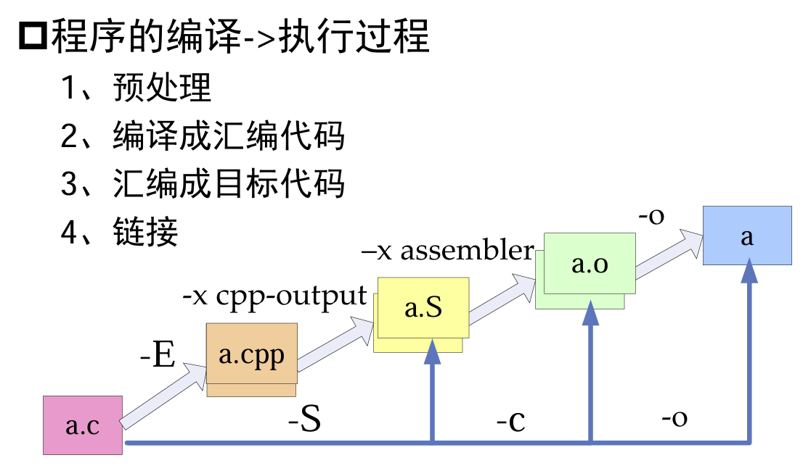

分支预测：当无法确定分支结果时，通过分支预测试图提升性能
- 需要分支预测缓冲器、分支历史表等

RISC-V 的存储器
- 内存按字节编址
- 采用小端存储
- [不要求字在内存中对齐](https://gemini.google.com/share/41dbe0a90a1a)

MIPS 指令集中加载/存储指令都属于 I 类型；RISC-V 指令集中加载、存储指令属于两个指令类型

基本块：一个指令序列，其中没有嵌入分支（位于结尾时除外），也没有分支目标（位于开头时除外）
- 编译器可以识别并优化基本块的执行

立即数字段的设计和拆分原则
- 保持不同类型的指令格式尽可能一致
  - SB 类指令的 `imm[10:5], imm[4:1]` 字段位置与 S 类指令一致
  - UJ 类指令的 `imm[10:5]` 位置与 SB 类指令一致，`imm[19:12]` 位置与 U 类指令一致
- 立即数的符号位总是放在最高位
  - 为什么 SB 类指令的 `imm[12]` 要放在 `imm[10:5]` 旁边，而不是连成 `imm[11:5` 字段？
  - 为什么 UJ 类指令的立即数字段设计成 `imm[20],imm[10:1],imm[11],imm[19:12]`？

SB 类、UJ 类指令的跳转**最低位固定为 0**（只能跳转到偶地址）

同一类指令的指令编码 `opcode` 一般相同（除了 `jalr` 指令），具体指令的判别通过检查 `funct3` 字段确定

---
程序的编译过程

系统性能：软硬件协同发展优化的综合考量

高级编程语言的实现方式：编译执行/解释执行

编译执行的过程
1. 预处理
2. 编译成汇编代码
3. 汇编成目标代码
4. 链接

