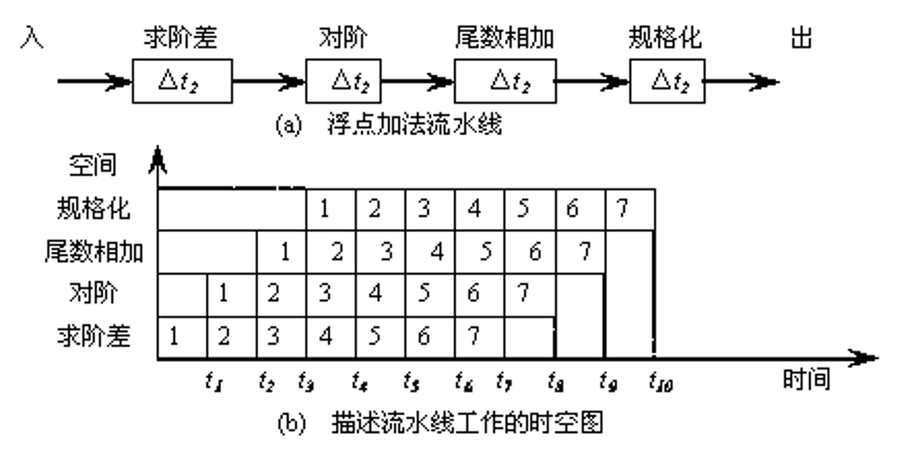

流水线：把一个完整工作分成不同阶段进行处理
- 将不同产品的不同步骤重叠在一起执行（实际上是**一种并行的策略**）
- 不能降低单个任务的执行时间

**吞吐率**：单位时间完成的任务数
**效率**：在整个任务执行时间中部件实际工作时间的比例
**等待时间**（响应时间）：任务从开始执行到执行完成所用的时间
  - 每个任务的等待时间不会因为应用了流水线而减少

希望流水线的各个步骤用时尽量接近
- 流水线一旦发生不均匀的情况，瓶颈出现在**用时最长的步骤**
- 最大加速比即为**流水站数**
  - **速度不匹配**（流水线不均匀）的情况下，理论上也无法达到最大加速比
  - 即使速度匹配，在**流水线填充和排空**的时间影响下，也无法达到最大加速比

流水化是一种方法论，可以应用于不同的场景

流水线的时-空图

流水线的分类
- 单功能/多功能流水线：看同一条流水线能否通过**改变各段的连接顺序和连接情况**执行不同的任务
- 静态/动态流水线：流水线的各段是否能*同时*按照不同的连接方式执行不同的任务
- 线性/非线性流水线：同一个段在执行单项任务时是否**可复用**
  - 非线性流水线的缺点：需要确定什么时候可以向流水线引入新的输入
- 顺序/乱序流动流水线：先进流水线的任务是否先完成

流水线的性能指标
- 吞吐率
  - 最大吞吐率 $TP_{\max}$：流水线**达到稳定状态**后的吞吐率
    - 若流水线各段时间相等，则 $TP_{\max}=\frac{1}{\Delta t_0}$
    - 若流水线各段时间不等，则 $TP_{\max}=\frac{1}{\max\Delta t_i}$
    - 消除瓶颈段的方法：细分瓶颈段、重复设置瓶颈段（并行）
  - 实际吞吐率 $TP$：$m$ 级流水线完成 $n$ 个任务过程的吞吐率
    - 在流水线出口看，分别考虑第一个任务和其余的任务
    - 若各段时间相等（为 $\Delta t_0$），$TP=\dfrac{n}{m\Delta t_0+(n-1)\Delta t_0}=\dfrac{TP_{\max}}{1+\frac{m-1}{n}}$
      - 因此流水线适合做连续大量任务，任务量越大，实际吞吐率越高
      - 即使遇到分支、跳转指令，也要尽量让流水线不停顿
    - 若各段时间不等，第 $i$ 段用时 $\Delta t_i$（令 $\Delta t_j=\max \Delta t_i$），则 $TP=\dfrac{n}{\sum^m_{i=1}\Delta t_i+(n-1)\Delta t_j}$
- 加速比 $S=\frac{mn}{m+n-1}=\frac{m}{1+\frac{m-1}{n}}$（假设各段时间相等）
- 效率 $E$
  - 在流水线启动、停止时一定有**部分部件不在执行任务**的时刻，因此 $E<1$
  - 整个流水线效率 $E=\frac{n\Delta t_0}{T_{流水}}=\frac{n}{m+n-1}=\frac{1}{1+\frac{m-1}{n}}$
  - $E=\frac{S}{m}$
  - $E=TP\cdot\Delta t_0$
    - 为提高效率而采取的措施，也有助于提高吞吐率
