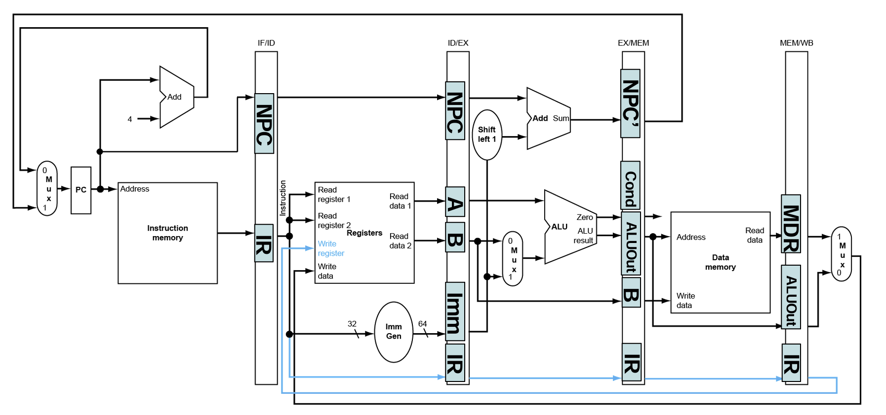
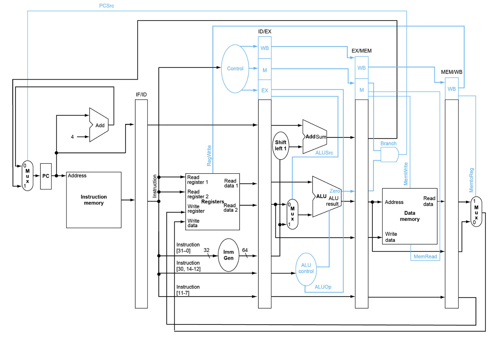

在流水线的架构中，每个段都有可能用到运算部件，因此不能像简单多周期 CPU 一样只采用单个 ALU 执行所有运算
- 与单周期 CPU 设置多个 ALU 的目的有所区别：流水线 CPU 的多个运算部件**分别用于不同指令的执行**

指令和数据存储器应当分离，在同一个时钟周期内它们会用于执行不同的指令

如何判断需要加入什么寄存器？
- 先画出完整的数据通路，再根据划分的流水段画出虚线边界，看有多少条数据线跨过了段边界
- 对于每条跨过边界的数据线，都需要**在对应的段边界上设置一个寄存器**

在指令执行到一个段时，能使用的、属于这条指令的资源**只有该段之前的段间寄存器中的数据**
- 在当前段考虑传递什么数据时，不仅要考虑到下一段需要使用什么数据，**还需要考虑后续段需要使用什么数据**
- **透传**的应用：`NPC` 透传过 `ID` 段，`ALUOut` 透传过 `MEM` 段，`rd` 透传到 `WB` 段

一般流水线上每条指令的执行周期必须连续（一些指令可以不执行后续的段，但**不允许跳段执行**）以保证指令执行的 FIFO，避免部件使用的冲突和流水线混乱

流水线的控制信号：全部来自指令，因此在 `ID` 段产生所有控制信号后都需要**写入段间寄存器向后传递**

不同指令集数据通路的区别：根据指令集设计偏好得到不同的编码，再根据 CPU 架构的不同有不同的实现
- 分支目标地址的计算方法：基于 `PC` 还是 `PC+4`？
- 目标寄存器编号如何提取？是否在指令中有固定的位置？
- 立即数如何产生？是否需要符号扩展/拼接？

---
### 相关（冒险）
[相关、依赖、冲突、冒险的辨析](https://gemini.google.com/share/e2334762850b)
- 相关是**程序固有**的依赖关系
- 冒险是在**程序执行时**可能出现的问题，程序实现上的相关可能导致执行时的冒险

相关的分类
- 结构相关：多条指令需要使用同一资源
  - 由于硬件资源（ALU、存储器、寄存器）不足导致
  - 可以通过让流水线暂停（stall）一个时钟周期尝试解决相关
    - 相对“万能”的方法：通过牺牲性能换取结果的正确性
    - `PC` 不变，或插入一条空指令（空指令也要有硬件上的相应实现）
      - 空指令**由编译器添加**
      - `PC` 不变，通过在编写 RTL 时判断（**硬件**的解决方案）
- 数据相关：后一条指令需要用前一条指令的运行结果
  - 大多数指令集**设计时希望是串行执行的**，但流水线尝试将它们并行执行
- 控制相关：指令的执行依赖分支指令结果
- **所有流水、并行的结构**都可能产生三种相关
