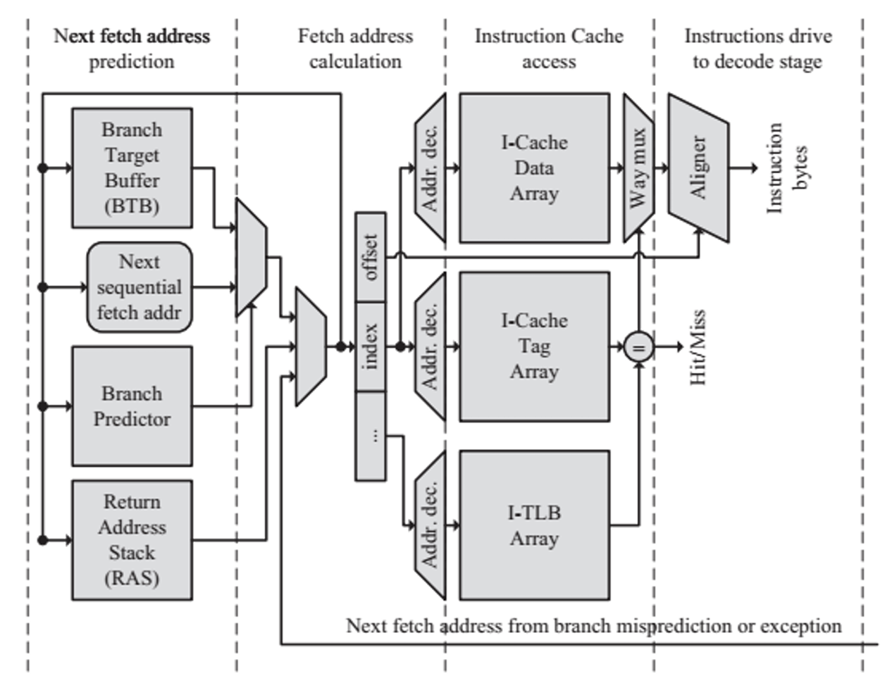
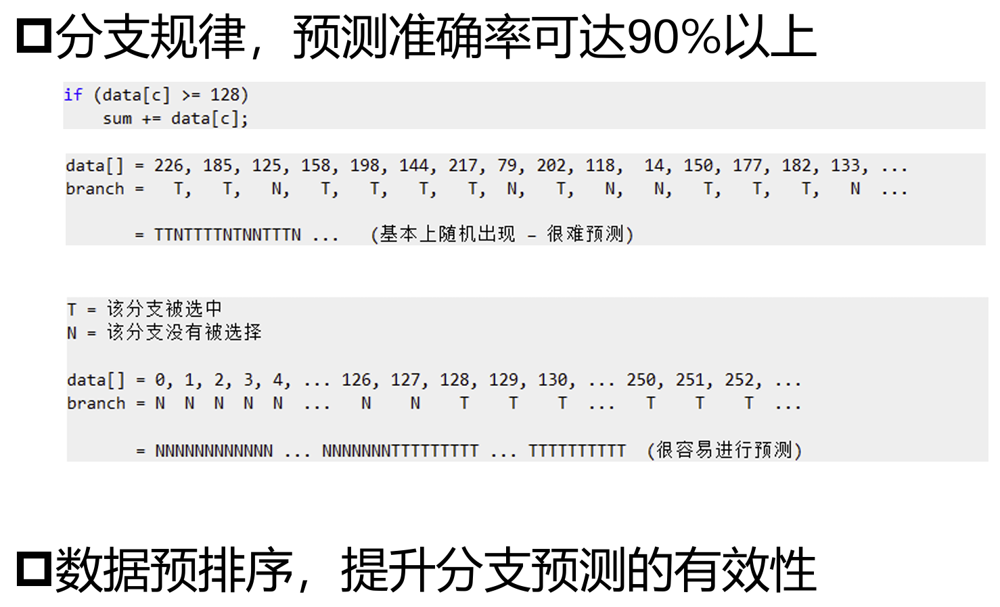
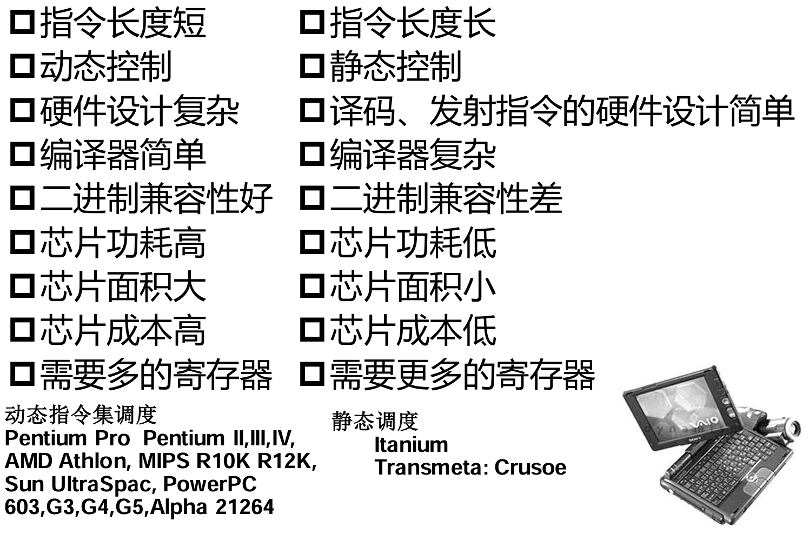
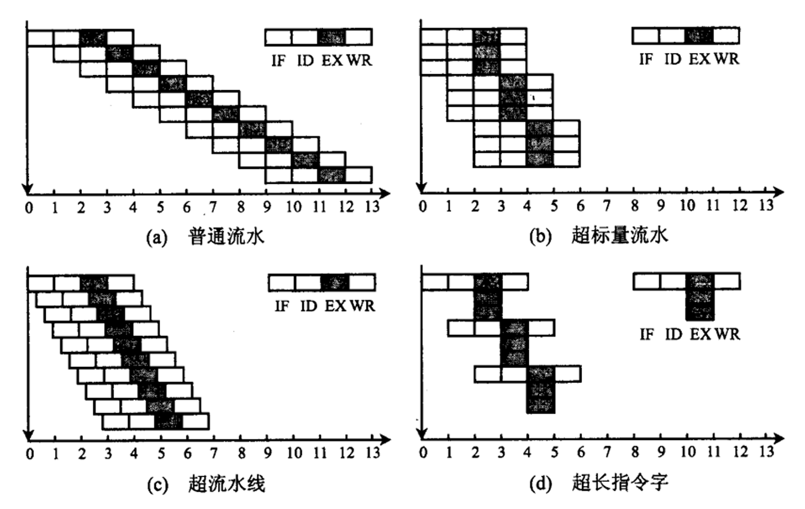

控制相关：由分支指令导致
- 降低 `beq` 的分支延迟：在 `ID` 段就计算出分支跳转目标地址，并计算 `rs1` 和 `rs2` 的数据是否相同
  - 分支延迟可以降低到 1 个周期
- 进一步利用 1 个分支延迟：体系结构层面，**延迟分支**
  - 在延迟槽中填入某些指令，无论分支是否成功都将执行
  - 延迟分支的来源：从别处调度一条指令
    - 从前调度：使用分支指令之前的某条指令填充
      - 把与分支跳转无关的指令放入延迟槽
      - 要求**该指令的执行效果不能影响分支指令的判断结果**
      - 作用前提：任何情况，分支成功或失败时都能掩盖分支延迟
    - 从目标处调度：使用分支跳转目标地址后的指令填充
      - 分支失败时执行该指令不会导致错误
      - 作用前提：分支成功时
    - 从失败处调度：使用跳转失败时的后续某条指令填充
      - 分支成功时执行该指令不会导致错误
      - 作用前提：分支失败时

分支预测
- 基本假设：使用循环结构时，大部分边界判断结果都是调回循环中继续执行
- 静态预测：投机执行，认为向后跳转（**往回跳**）一定成功，向前跳转（**跳出循环**）一定不成功
- 动态预测：根据**上次跳转历史**预测本次跳转是否成功
  - 1 位转移预测缓冲：用一个状态位记录指令上一次是否发生跳转；若预测失败，则更新状态位
    - 第一次遇到该指令时，**先按静态预测跳转**，同时把该指令的地址放入缓冲器
  - 2 位转移预测缓冲：只有连续两次预测不成功时才修改转移预测的方向
    - 在存在**嵌套循环**结构时可减少预测失败的次数
  - 理论上也可以根据更多跳转历史进行预测，但一般 **2 位预测已能达到较高精度**
- 加入分支预测之后，可能需要进一步细分流水段，以完成更多动作
- [带分支预测的细分 IF 段流水线 CPU](https://gemini.google.com/share/c3361ec9d774)
  
- 通过对数据进行预排序可提升分支预测的有效性
  

cache miss stall
- 访存部件的操作完成时间不确定
- 使用 cache 可以降低访存代价，但不能保证一定能在 cache 中命中需要的数据
- 当没能在各级 cache 中找到需要的数据时，就需要暂停流水线，到内存中找需要的数据

流水线的多发射技术
- 要想使 $\text{CPI}<1$，不能靠简单流水线实现
- 在一个时钟周期内必须流入多条指令，才有可能在一个时钟周期内流出多条指令
- 超标量技术
  - 超标量：在每个时钟周期内可同时发射并执行多条指令
  - 需要在硬件上进行支持：多个功能部件、多个译码电路、多个寄存器端口、多个总线
  - 需要编译器支持：由编译器判断指令之间的依赖关系，不能同时执行有依赖关系的多条指令
  - 动态指令集调度：在 CPU 中加入额外的硬件逻辑，判断指令的执行状态（是否进入 CPU，执行到什么阶段）
    - 包括记分牌、Tomasulo 等方案
- 超流水线：在一个时钟周期内实现更细的流水段
  - 例如在上升沿执行一段，在下降沿进入另一段
  - 与组成原理关系不大
- 超长指令字
  - 把若干条可并行操作的指令预先组合成为一条超长指令
  - 其中每个操作码字段都控制一个功能部件
  - 与超标量技术的区别
    - 超长指令字是一条指令，指令集发生变化，会导致编译器需要作出相应修改
    - 超标量技术的指令集与简单标量一致
    - 超长指令字的多条数据通路之间可能存在不同（例如，分别服务于简单算术逻辑运算和访存指令）
    - 
- **四种流水技术比较**
  
