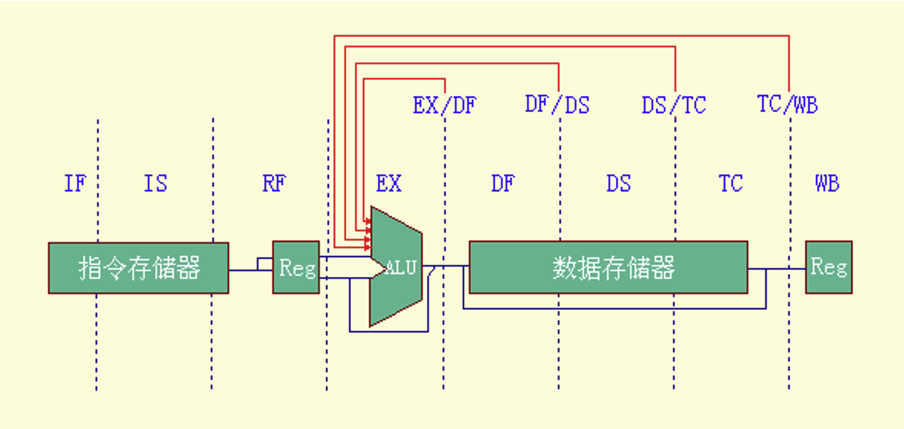
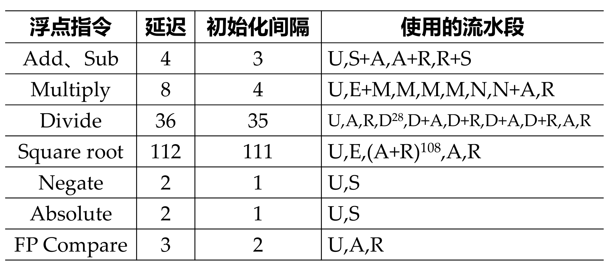
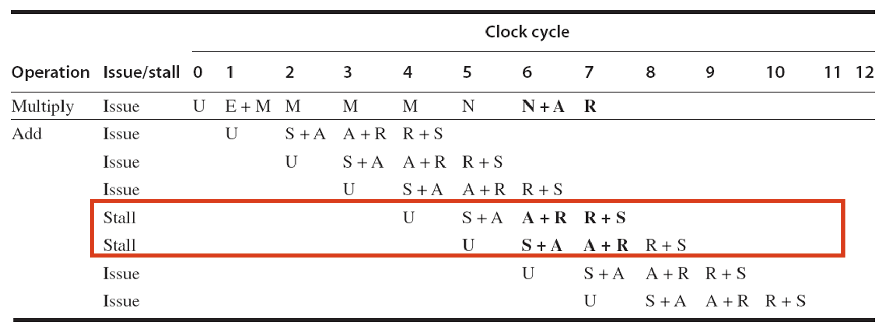

超长指令：把多条能并行操作的指令组合成一个新的指令
- 指令集、编译器、工具链等都会发生变化

数据级并行：在一条指令中放入多个数据并行执行**相同的运算**，提高任务吞吐量
- [数据并行 & 指令并行，SISD/SIMD/MIMD](https://gemini.google.com/share/8fec016f432a)

8 级流水线
- `WB` 段仍然位于最后
- 由于运算结果需要缓存更多时钟周期才能写入（**保证只出现 RAW 数据相关**），相应也需要更多旁路路径
  
- 分支延迟的处理：把分支条件判定提前到 `EX` 段；引入延迟槽

浮点流水线
- 理论上可以用整型部件操作浮点运算，但**存在显著的精度损失**，无法用于科学计算
- 基于现有 5 级流水线的改造：在**译码 `ID` 段**，如果检测到是浮点指令，就**把指令执行路径重定向到浮点运算部件**
- 结构相关问题：浮点运算指令**在不同的时钟周期会使用相同的部件**，从而造成指令的初始化间隔不再是 1 个时钟周期
  
  - **不是指令之间间隔越长越好**；可能出现间隔周期数是一个特定值时反而造成结构冒险
    
