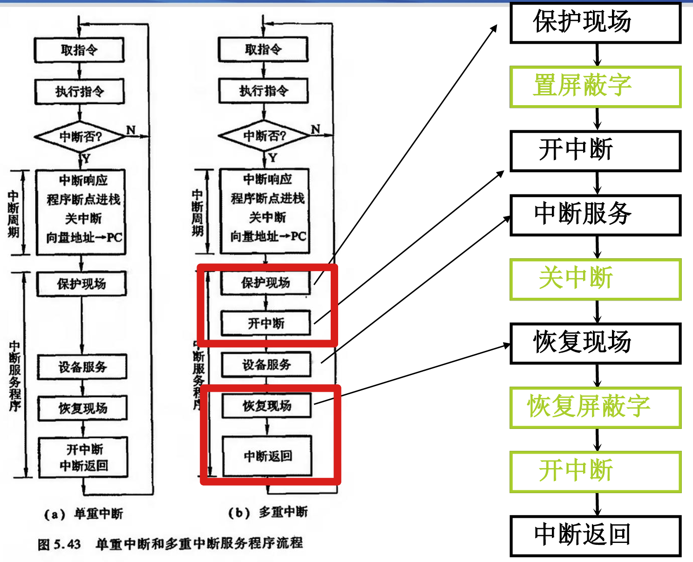
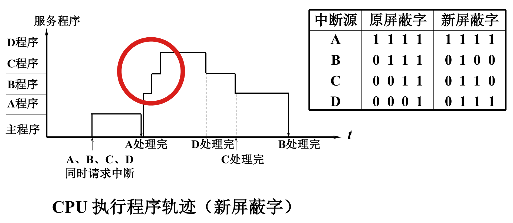

### 5-中断与异常
典型的中断

中断系统需要解决的问题
- 中断如何提出？如何处理并发中断？
  - 中断请求标记 INTR，每个中断源对应一个 INTR
  - INTR 可以分散在各个中断源的接口电路中，也可以集中在 CPU 内
  - 中断判优：轮询（软件），链式排队器（硬件）
- CPU 如何处理中断？条件，时间，方式？
  - 在指令执行周期结束时由 CPU 发出查询信号
  - 外部中断（I/O）：**异步**（延迟）响应，在指令周期结束后才响应
  - 内部中断（陷阱、异常）：**同步**（立即）响应
- 如何保存现场？如何恢复现场？
  - 断点由中断隐指令保存，**寄存器内容由 ISR 保存**
- 如何寻找中断服务例程 ISR 的入口地址？
  - 硬件向量法：向量地址上存储的是一条 `JMP` **指令**
  - 软件查询法：向量地址上直接存储 ISR 入口**地址**
- 如何应对处理中断的过程中出现新中断的情形？
  - 是否允许多重中断？
  - 在中断的保护现场过程中，必须禁用中断
  - 如果允许多重中断，保护现场完成后即可允许中断；否则，必须等到恢复现场完成后才可允许中断
    - [为什么恢复现场的过程不需要禁用中断？](https://gemini.google.com/share/2febf1c60796)
  - 在允许多重中断的条件下，**只有优先级更高的中断源才有权中断优先级低的中断源**
  - 通过设置屏蔽字动态修改优先级
    
    - 如果采用动态更新优先级的方案实现多重中断，则保护现场、修改屏蔽字、恢复现场的过程必须禁用中断
    - 屏蔽技术可以改变中断处理优先级，但**不能改变中断响应优先级**
        

中断机构组成
- 程序状态字 PSW 中的中断允许位 `IF`
- CPU 中断请求/响应控制 `INTR/INTA`
- 中断响应/返回：中断隐指令
  - 保护程序断点：将断点存入特定地址
  - 寻找 ISR 入口地址
  - 硬件关中断
- 保存现场：内存栈
- 中断服务
  - 中断源识别和判优：中断控制器
  - ISR 入口：向量/非向量方式

MIPS 的异常处理：以非法指令与算术溢出为例
- 共通过程：PC 赋值（PC 跳转到异常处理程序）、出错 PC 保存（`EPC`）、出错原因保存（`Cause`）
- 非法指令的处理在 `ID` 段即可完成识别并跳转，在正常指令执行到 `EX` 段时开始执行异常处理
- 算术溢出的处理在 `EX` 段*获得 `ALUOut` 数据*后可完成识别并跳转，在正常指令执行到 `MEM` 段时开始执行异常处理
  - 优化：把算术溢出的异常处理提前到 `EX` 段
