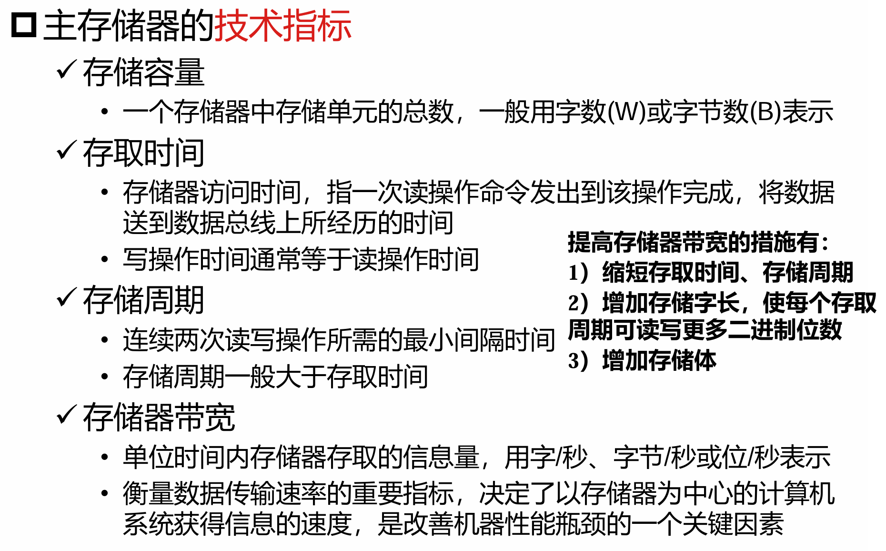

异常处理的切入时机
- 异常一发生就切入处理
- 发现异常后，等待操作执行完成
  - 即使涉及到寄存器的写入，也因为已标记异常状态而不会使用

在非流水线 CPU 中，由于指令串行执行，可以非常方便地在指令执行完毕后处理异常

流水线 CPU 的异常处理
- 额外执行的操作：**清除异常指令之后的所有指令**
- 与非流水线 CPU 处理方法相同的部分：记录异常原因、保存异常指令地址、转到异常服务程序

多重异常与非精确处理
- 流水线 CPU 执行过程中有多条指令，其中每条指令可能分别在不同段并发出现不同的错误
  - 例如，三条指令分别在 `MEM` 段出现缺页/越界，`ID` 段出现非法指令，`EX` 段出现 ALU 溢出
- **异常发生的顺序可能不同于指令执行的顺序**，后续指令在产生异常的指令完成之前可能改变系统部分状态
- 转移指令、分支预测也对异常处理带来一定干扰
- 两种解决方案：精确处理、非精确处理
  - 非精确处理方案 1：允许已进入流水线的指令执行完成后再执行中断处理
    - 优点：硬件实现上比较简单
    - 缺点：可能导致程序出错，不容易调试
  - 非精确处理方案 2：将异常指令的后续指令排空
    - **将异常视为一种控制相关**
  - 非精确处理的**异常响应时间较长**
  - 精确处理方案：将流水线停止，并完整保存流水线的当前状态
    - **需要大量后援寄存器**保存流水线中各个指令的执行现场
    - 采用 **“提交点”技术**，在指令执行到 `MEM` 段之前保存所有执行过程中出现的异常并向下段传递；在提交点处统一判断指令执行过程是否出现异常
      - 早期流水段的异常抑制后续流水段的异常，即优先处理早期流水段出现的异常
      - 提交点设在 `MEM` 段，能保证**前一条指令已执行完成**，**后续的指令没有完成写回**

---
### 6-存储
存储层次：CPU-Cache-主存-外存

各种存储器的典型延迟
- Cache：纳秒量级
- 主存：微秒量级
- 外存：毫秒量级

**（重要）** 主存储器的技术指标：用什么指标来评价一个存储器？

- 存储容量
- 存取时间：从发出访存指令到内存就绪所需的时间
- 存储周期：连续两次读写操作所需要的最小间隔时间
- 存储器带宽：单位时间存取的信息量
  - 提高带宽：缩短存取时间；增加存储字长；增加存储器
