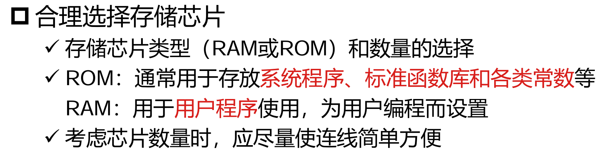
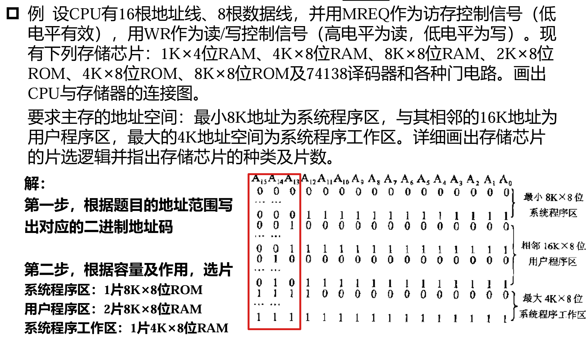
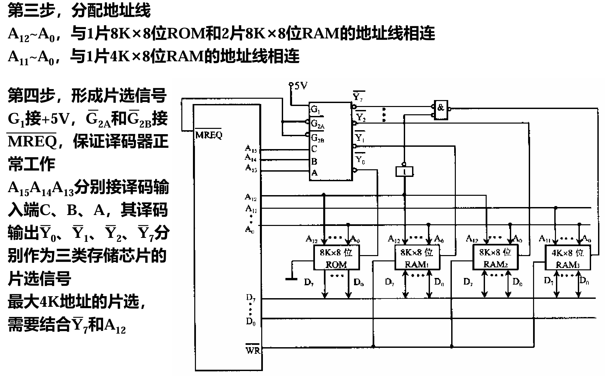
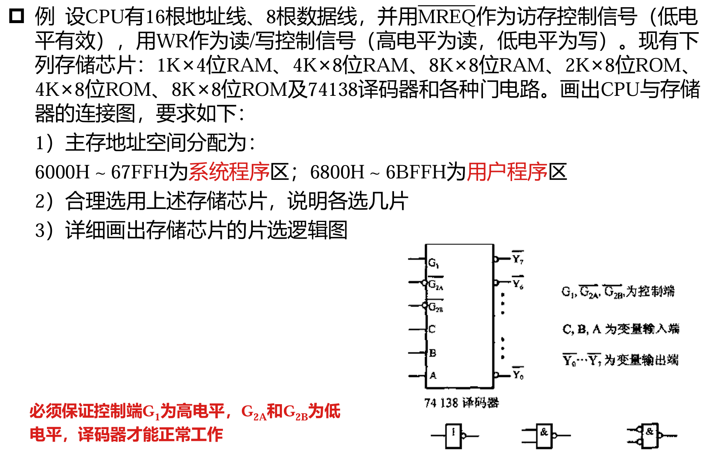
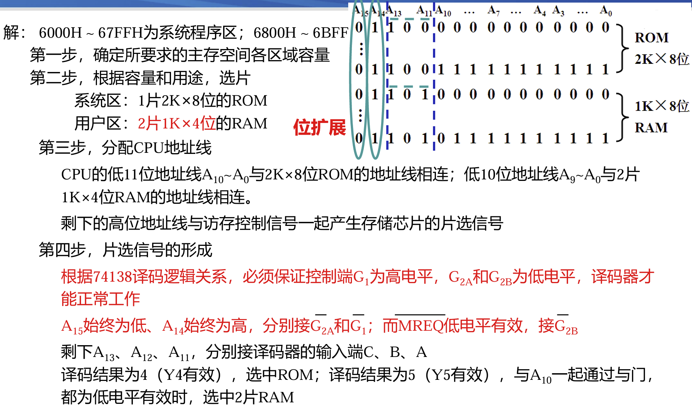
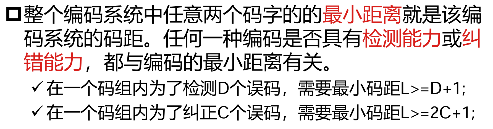
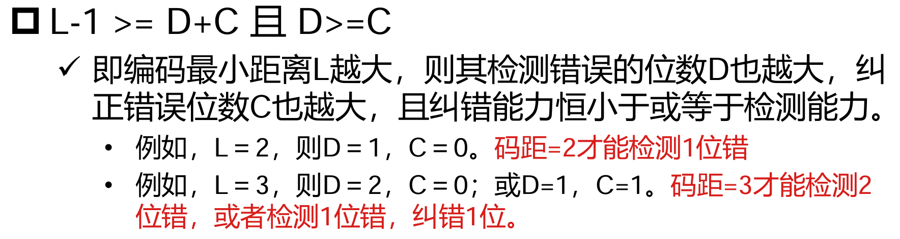
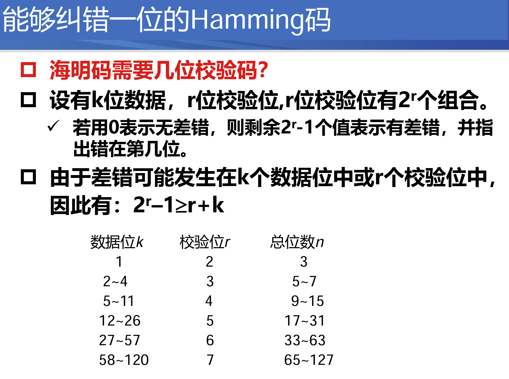

地址线和数据线共同反映存储芯片的容量
- 数据线：每次访存能提取出多大规模的数据
- 地址线：访存的范围有多大

[存储芯片的寻址方法](https://gemini.google.com/share/eba4629bf5b2)
- 线选法：读出一行（一个字）的数据
- 重合法：读出一个单元的数据

DRAM 与 SRAM 的区别
- 使用电容存储，存储过程耗时毫秒级别
- 寻址时需要先进行行选，再进行列选
- 需要使用地址锁存器进行缓冲而不是直接将地址传入译码器
- 数据需要刷新（把信息**读出后再写入**），引入一个刷新计数器
  - 集中刷新：在每一个刷新周期内留出一个专门的时段用于刷新
    - 读写速度快，但如果读写操作落在刷新时间（**死区**）内，会造成额外的时间成本
  - 分散刷新：在一个刷新周期内，每执行一次读/写操作，都强制附带对下一个待刷新行的刷新操作

存储器的扩展方法
- 位扩展：扩展**数据线**，两个存储单元使用相同的地址进行寻址，**将输出的数据拼接**得到最终数据
- 字扩展：扩展**地址线**，存储单元的**片选信号**根据扩展出的高位地址线上的数据产生
- 字、位扩展不冲突，可以同时进行

如何恰当选择与 CPU 连接的存储器类型？

- 注意：系统程序**工作**区，也需要选择 RAM

---

#### 题型
根据主存功能区域划分和 CPU 的地址线、数据线配置选用恰当的存储芯片

另一道例题：

---
提高访存速度
- 背景：CPU 运算速度提升远高于存取速度提升
- 解决方案
  - 双端口存储器：两组相互独立的读写控制电路
  - 并行访问存储器：单体单字变为单体多字/多体并行
    - 单体多字：一个存储体存储多个字的数据，可以同时把多个字的内存放入 Cache
    - 多体：多个存储体
      - 高位交叉：每个存储体存储一个连续的地址区域，通过**地址高位**选中对应的存储体；**扩展性**较好，在扩展内存地址时不需要修改前面低地址的区域
      - 低位交叉：按地址同余关系把数据放到各个存储体中，通过**地址低位**选中存储体编号；考虑到访存**局部性**，相比高位交叉可以提高内存带宽（**并行**度）

容错
- DRAM 的错误：由电磁干扰或硬件故障导致
  - 软错误：可修正，不损坏字位
  - 硬错误：会损坏字位，造成数据错误反复发生
- 解决思路：通过冗余掩盖失效
  - 信息冗余：通过校验位提供正确传输数据的部分信息；包括海明码、CRC 码、奇偶校验码等实现方案
    - 如果校验位不够多，携带的信息量就不足，可能造成数据出错的假阴性
  - 时间冗余：发现出错时回滚到上一个时间戳
  - 空间冗余：用多个相同功能部件同时计算，按多数的成果仲裁
- 奇偶校验
  - 码距：一个编码方案中任意两个合法编码（称为**码字**）之间不同的 bit 数量称为这两个码字之间的码距（汉明距离）；一个编码系统中任意两个码字的最小距离称为该编码系统的码距
  - 编码纠错理论
    
- 海明码
  
