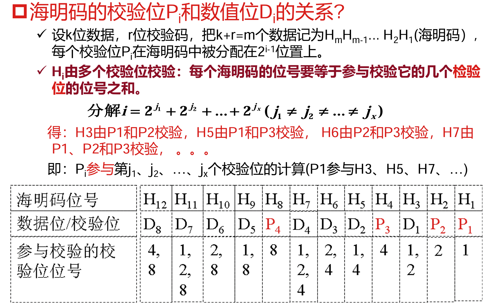
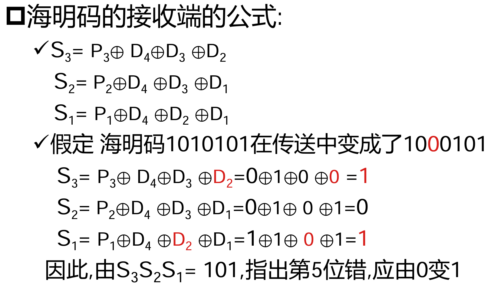

从有效信息来看，信息冗余处理会降低数据带宽

海明码
- 海明码从低位到高位依次编号为第 $1, 2, \cdots$ 位
- 校验位放在 $2^{i-1}$ 位上，与数据位交错排布形成海明码
- 第 $j$ 位上的数据通过 $j=2^{j_1}+2^{j_2}+\cdots$ 关系确定的校验位校验
  
- 校验位上的数值由其参与校验的所有位上的值的异或和确定（例如，第 1 位上的海明码由第 $3, 5, 7, \cdots$ 位上的海明码确定
- 海明码纠错示例
  

[CRC 纠错](https://gemini.google.com/share/7c75e3cf43b1)
- 余数与出错位之间的对应关系与实际数据无关，只与生成多项式有关
- “循环”：余数左移一位再除 $G(x)$，截低位得到对应下一位出错的余数
- 生成多项式的要求
  - 不同位上出错对应的余数都不同
  - 任何一位发生错误，应使余数不为 0

---

Cache
- 背景
  - 主存与 CPU 的速度不匹配
  - 避免 CPU 与 I/O 设备的访存冲突：主存与 I/O 设备交换信息时，CPU 可以访问 Cache 获取信息
- Cache 的实现对软件程序员透明
- Cache 与主存之间的数据交换以块为单位，将访存地址划分为**主存块号+块内地址**
- Cache 命中率：衡量 Cache 性能效率
  - 记 $N_c, N_m$ 分别是访存过程中实际访问 Cache 和主存的次数，则命中率 $h=\dfrac{N_c}{N_c+N_m}$
  - 记 $t_c, t_m$ 分别是命中时 Cache 的访问时间和未命中时主存的访问时间，则平均访存时间 $t_a=ht_c+(1-h)t_m$
  - 访问效率 $e=\dfrac{t_c}{t_a}\times 100\%=\dfrac{t_c}{ht_c+(1-h)t_m}\times 100\%$
- 命中率与容量的关系：Cache 越大，命中率越高，但同时成本越高
  - 随着容量增加，Cache 的命中率增长越来越慢
  - 程序局部性的限制：一般来说，约 10 条指令后会有一条跳转指令
  - 当容量已经**足以容纳大部分完整的顺序执行块**后，再增加 Cache 容量对于命中率的提升效果就变得不显著
- 命中率与块长的关系
  - 取决于程序的局部特性
  - 随块长增大，命中率先升后降
  - 在 Cache 总容量不变的情况下，块越大时能缓存的局部性代码/数据数量越少
  - 通常块长取每块 4—8 个字
- Cache 与主存的地址映射
  - 全相连：主存中每一个块都可以映射到 Cache 中任何一个块上
    - 比较器需要比较每一个 Cache 块的地址标记与访存地址是否相同
  - 直接映射：一定连续范围的主存块一定映射到 Cache 中的一个特定块
    - 根据 **Index 段**的值确定映射到哪一个块
  - 组相连：主存块一定映射到 Cache 某个组中的一个任意的块
    - 根据 Index 段的值确定映射到哪一个组，根据 Tag 段的值确定某个块是否是访存所需要的
    - 组间直接映射，组内全相连映射
    - 实际上是全相连映射与直接映射的一个折中方案
    - 在 Cache 块数一定的情况下，一个组中路数越多，组数越少，**Index 段的位数越少**
- Cache 的写策略：写命中时
  - 写直达：写操作时数据既**写入 Cache**，也写入主存
    - 写操作时间取决于写入主存的时间
    - 更新策略易于实现，读操作时不涉及对主存的写操作（**没有换出过程**）
  - 写回：只写 Cache，不写入主存
    - 写操作时间取决于写入 Cache 的时间
    - 在**多个 CPU** 场景下，可能因为主存中信息没有及时更新导致另一个 CPU 读出的数据错误
- Cache 的写策略：写失效时
  - 按写分配（写时取）：写失效时，先把目标单元所在的块调入 Cache，再写入
  - 不按写分配（绕写法）：写失效时，**直接写入下一级存储器**
  - 写回法通常搭配按写分配，写直达法通常搭配不按写分配

在使用虚拟存储器时，在访存之前先将虚拟地址转换为物理地址
- TLB(**Translation Look-aside Buffer**)：为了加快通过虚拟地址找到物理地址的过程，将近期使用到的映射存入 TLB
