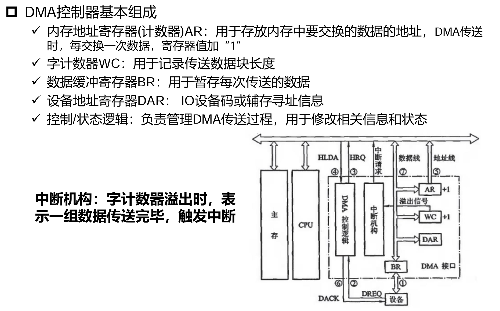
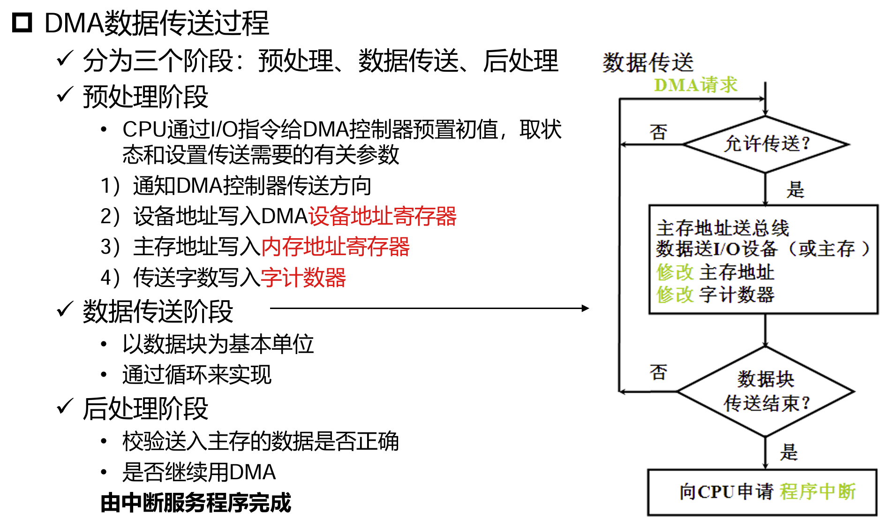
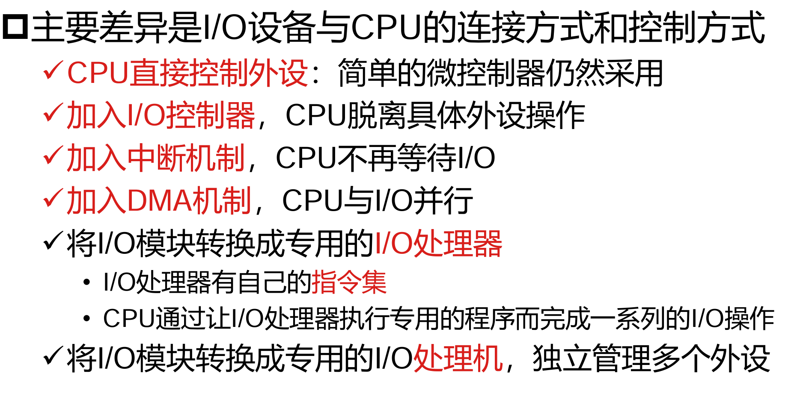
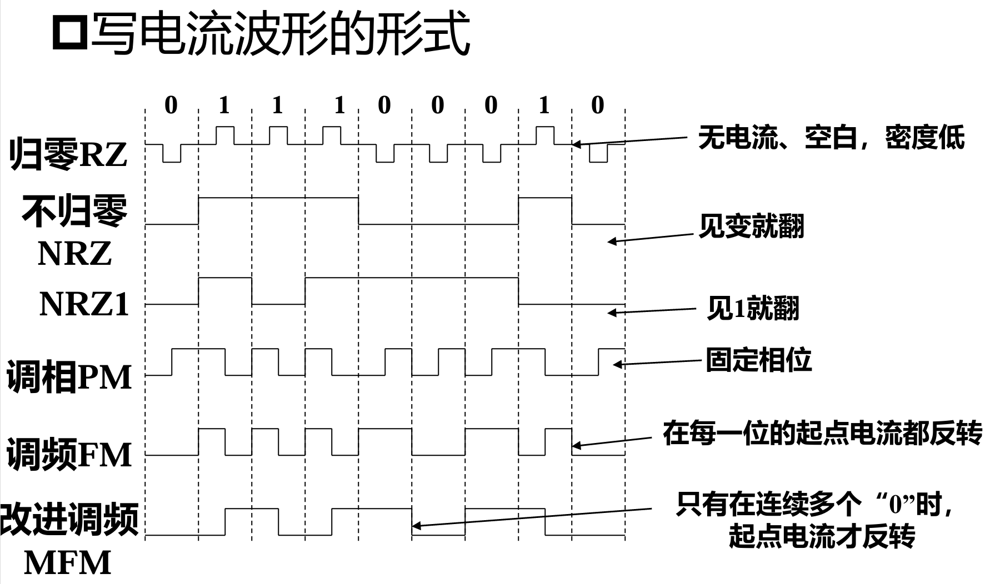
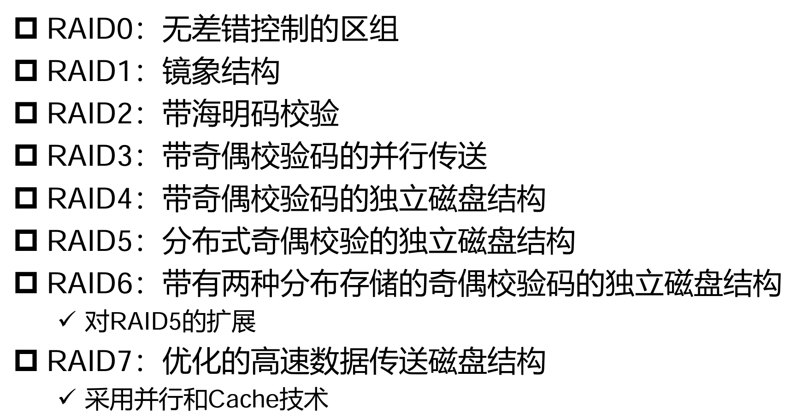
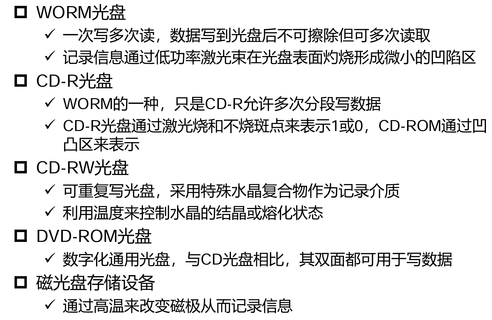

### I/O 系统
I/O 指令
- 机器指令：由 CPU 执行
- 通道指令：对具有通道的 I/O 系统专门设置的指令，在通道上执行
  - CPU 执行 I/O 指令后，由通道指令接管 I/O 设备的管理

I/O 设备的编址
- 统一编址：I/O 设备地址作为存储器地址的一部分；I/O 指令与访存指令类似，较简单
- 独立编址：I/O 地址与存储器地址分离；需要使用专门的 I/O 指令访问 I/O 设备

I/O 设备与主机的联络方式
- 立即响应：针对工作速度缓慢的 I/O 设备，不使用控制信号
- 异步应答信号：I/O 设备与 CPU 工作速度不匹配
- 同步联络：I/O 设备与 CPU 工作速度完全同步

---

### I/O 接口
接口与端口
- 端口是接口电路中的一些**寄存器**
- 若干端口加上相应的控制逻辑组成接口
- CPU 对 I/O 接口（I/O 设备）的信息读写，实际上都是对端口的操作

I/O 接口的基本组成
- 数据缓冲寄存器
- 设备选择电路
- 设备状态标记
- 命令寄存器、命令译码器

---

### I/O 信息交换方式
程序查询方式
- 硬件结构简单，CPU 与外设之间的操作同步
- CPU 控制其与外设之间的数据传送
- 占用 CPU 资源较多

程序中断方式
- 每个外设在需要服务时向 CPU 发出中断信号，CPU 接收到信号后暂时中止现行程序来处理中断，处理完成后重新开始执行主程序
- 如果中断处理需要的时间较长，可能影响 CPU 性能

DMA 方式
- DMA：**直接内存访问**，完全由硬件执行 I/O 交换
  - 主存与 I/O 设备之间高速交换批量数据
  - 硬件 DMA 控制器从 CPU 接管总线控制权，**数据交换不经过 CPU**
- CPU 通过程序或中断方式对缓冲器和 DMA 控制器进行预处理和后处理
- [CPU 在 DMA 方式信息交换过程中起到的作用](https://gemini.google.com/share/a7cc0ee04730)
- DMA 与主存交换数据的三种方式：CPU 与 DMA 同时希望访问内存，如何处理？
  - 停止 CPU 访问内存：完全交由 DMA 访问主存
  - 周期挪用：DMA 与主存间传送一个单位数据时，占用（窃取）若干 CPU 周期，在此期间 CPU 不工作
  - 交替访存：将 CPU 周期分为专供 CPU 访存的部分和专供 DMA 访存的部分
- DMA 控制器的基本组成
  
- DMA 数据传送的基本过程
  

各种 I/O 通信方式从简单到复杂的演进

---

磁记录设备
- 随机方式读写：RAM
- 顺序方式读写：磁带
- 直接方式读写：磁盘（扇区的定位采用随机方式，依靠磁盘旋转可直接找到某一扇区，而扇区内则采用顺序读写方式）

磁盘的技术指标
- 记录密度：道密度、位密度
  - 道密度：沿半径方向单位长度内的磁道数量
  - 位密度：单位长度磁道记录的数据位数
- 容量
  - 磁盘总容量 $C=n\times k\times s$，$n$ 代表盘面数，$k$ 代表单盘面上的磁道数，$s$ 代表每个磁道上记录的数据位数
  - 非格式化容量：可以利用的总磁化单元数
  - 格式化容量：按某种特定记录格式可存储的信息总量，一般约为非格式化容量的 **70%~80%**
- 寻址时间
  - 寻址寻址时间包括寻道时间（$t_s$，找到目标磁道的时间）和等待时间（$t_w$，在目标磁道上找到数据的时间）
  - 平均寻址时间 $T_a=\dfrac{t_{s\max}+t_{s\min}}{2}+\dfrac{t_{w\max}+t_{w\min}}{2}$
  - 对于磁带寻址，其寻址时间等于磁带的空转时间
- 传输率、误码率
  - 传输率：单位时间传输的数据量
    - $D_r=D\times V$，$D$ 是数据记录密度，$V$ 是介质运行速度（如磁盘旋转速度）
  - 误码率：读取数据时出错位数与读出总位数的比例

磁记录方式（编码方式）
- 自同步能力：从磁头读出信号中**可以推得同步信号**（如时钟信号）
- 归零制 RZ：正脉冲为 1，负脉冲为 0；在记录下一位信息前**电流归零**；有自同步能力
- 不归零制 NRZ：磁头线圈始终有电流，电流方向在 0/1 或 1/0 翻转时切换；无自同步能力
- 见 1 翻转的不归零制 NRZ1：在记录 1 时电流方向切换，记录 0 时不切换；无自同步能力
- 调相制 PM：单个周期内，记录 0 时电流方向由负变正，记录 1 时电流方向由正变负；有自同步能力
- 调频制 FM：“1”位数据频率是“0”的两倍，在位边界上翻转一次；有自同步能力
- 改进调频制 MFM：连续出现两个及以上的“0”时，在位边界上翻转一次；有自同步能力
- 编码效率：位密度与磁化翻转密度的比值，用记录单个位时可能的最大翻转次数表示
  - FM、PM 最多翻转 2 次，效率 $50\%$
  - NRZ、NRZ1、MFM 最多翻转 1 次，效率 $100\%$

RAID 技术

CD-ROM 光盘
- 存储方式：光盘上信息以坑点形式存储，有坑点表示 1，无坑点表示 0
- 光道—扇区，扇区是最小可寻址单位

其它种类光盘

Flash 存储器
- 写入、读取以页为单位，**擦除以块为单位**
- 写入操作不能实现原地修改，需要引入额外的擦除操作
