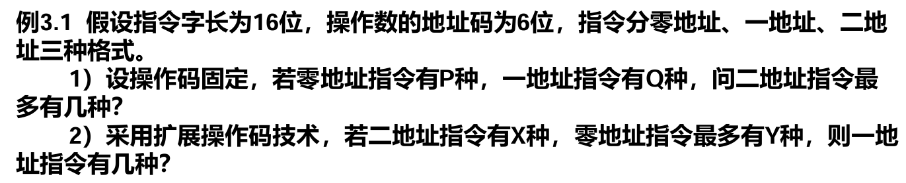

### 课程回顾
**第 1 章**：了解计算机系统构成，熟悉计算机系统性能评估方法
- 性能评估方法：芯片成本计算、CPU 时间、Amdahl 定律（加速效果）
  - CPU 时间：程序执行的总周期数 $\text{CLK}$，计算机工作的时钟频率 $f$，$T_{\text{CPU}}=\frac{\text{CLK}}{f}$
  - **响应时间**：事件开始到结束的时间；用户标准
  - **吞吐率**：单位时间内能完成的工作量；多道程序系统视角
  - 性能比较：“X 比 Y 快”指的是 Y 的响应时间比 X 长（可以进一步量化），或者 X 的性能比 Y 好（性能与响应时间成反比）
  - 可靠性：平均无故障运行时间 **MTBF**
  - 可用率：平均修复时间 MTTR，可用率记为 **MTBF/(MTBF+MTTR)**
- 计算机的层次
  - 应用语言→高级语言→汇编语言→操作系统→机器语言→微指令系统
  - **每条机器码执行一个微程序**，每条微指令在一个时钟周期内指示某个功能部件完成一个原子硬件操作
  - 操作系统为汇编语言/高级语言提供其执行过程中使用的**基本操作的具体实现**，并管理计算机软硬件资源
- 计算机处理一条指令的过程
  - 例如，处理一条输出字符串指令的过程
  - 如何串联各个组件？CPU、主存、磁盘、显示器
  - 冯·诺依曼架构的特点：五大功能组件，指令和信息如何表示，...
- CPU 发展趋势：核集成度→频率扩增→核扩增
  - CPU 发展过程中遇到哪些墙？处理和解决的思路是什么？
  - 存储墙与 I/O 墙：利用程序的时空局部性原理，引入存储器层次结构、访存 burst 技术、RAID 技术
  - 频率墙与线延迟墙：通过指令级并行增加在一个时钟周期内能完成的工作量，从而提高性能，引入流水线、超标量、超长指令字、乱序多发射等技术
- **Amdahl 定律**：加速的成本是什么？加速带来的效益是否足以覆盖成本？
  - 可改进比例 $f_e$，部件加速比 $S_e$，$S=\dfrac{1}{(1-f_e)+\frac{f_e}{S_e}}$
  - Amdahl 定律固定工作量来计算加速比，是一个悲观结果；Gustafson 定律提出固定并行计算时间来计算加速比，得到乐观结果
  - Gustafson 定律：性能与核心数成正比
- CPU 性能公式：$T_{\text{CPU}}=\text{CPI}\times \text{IC}\times T_{\text{CLK}}$，如何从三个参数入手分别进行优化？
  - 程序总指令数 $\text{IC}$，$\text{CPI}=\frac{\text{CLK}}{\text{IC}}$
- 
- 冯诺依曼结构与哈佛结构的主要区别
  - 指令、数据是否分离存储
  - 是否对指令、数据存储使用两条独立总线，两条总线之间毫无关联
- 运算器最少需要包括三个寄存器：累加器 ACC、乘商寄存器 MQ、操作数寄存器 X
- 控制器的三个关键组件
  - 程序计数器 PC：当前执行的指令地址，取指后可以自动指向当前指令的后继
  - 指令寄存器 IR：当前执行的指令内容
  - 控制单元 CU：根据当前指令内容，发出各种控制信号和微操作命令序列，控制计算机其它部件的工作
- 存储器：存储体、各种逻辑部件和控制电路
  - **存储元件→存储单元→存储体**
  - 一个存储元件可以存储一个二进制位，例如一个触发器
  - 一个存储单元通常可以存储一串二进制数，称为一个**存储字**，这串数的二进制长度称为**存储字长**
  - 注意**存储字与 CPU 采用的机器字并不一定相同**：存储器按字节寻址，则一个存储字即为一个字节；存储器按字寻址，则一个存储字即为一个机器字
  - 存储地址按存储单元进行编号
  - MAR、MDR：分别存储访存过程使用的地址和数据；MAR 的字长等于存储地址的位数，MDR 的字长等于存储字长
  - （题型）如何**由 MAR、MDR 推出存储单元数、存储容量**？
- 计算机组成与计算机系统结构的关系：看作业 1 的简答题

**第 2 章**：了解指令系统的原理，能设计功能完备、性能优异的指令集（`260318.md`）
- 字节序：小尾端（低位放在低地址），大尾端（高位放在低地址）
- 指令寻址方式：顺序寻址（通过 PC 自增找到后继）、跳跃寻址（由**指令地址码域**给出下一条指令地址）
- 数据寻址方式：哪些指令可以访存？
  - MIPS 指令集的寻址方式
    - 立即寻址：I 型指令
    - 寄存器寻址：R 型指令
    - 基址寻址：I 型指令
    - PC 相对寻址：I 型指令
    - 伪直接寻址：J 型指令；在当前 PC 所在的 256 MB 代码段内跳转到任意位置
  - RISC-V 和 MIPS 指令集的指令差异，性能和指令功能分区的权衡（例如，立即数的拼接）
- 
- 指令格式：操作码+地址码，地址码指定操作数的存储位置
- n 地址指令：指令中有 n 个地址码域
  - 根据其余每种 i 地址指令数量计算其中某种 k 地址指令数量
- 指令字长：单字长指令（等于机器字长）、半字长指令、双/多字长指令（需要多次访存才能取出一条指令）
- 边界对齐：多字节数据存储时按半字/字对齐，否则读取一个数据时可能需要多次访存（每次访存只能取一个完整的字，不能跨字读取）
- CISC 指令集通常采用微程序来完成每一条指令，RISC 指令由于较为简单，通常采用组合逻辑实现控制，硬件执行速度更快

**第 3 章**：设计并实现单周期、多周期的处理器（数据通路、控制信号、状态机），进行性能评估
- 多周期中指令执行的阶段划分

**第 4 章**：设计并实现流水化的处理器（数据通路、控制信号、状态机），进行流水线性能评估，掌握各种相关的产生原因、解决方法
- 流水线：在多周期的基础上，充分利用空闲的部件
- 流水线的性能评价：吞吐率、加速比、效率
- 结构相关：硬件资源不足
- 为什么产生了数据相关？数据依赖
  - 旁路技术（判断、传送）
  - 互锁（识别、停顿）
- 控制相关：分支指令
  - 如何降低分支指令带来的开销：判断过程放到 `ID` 段，这一段实际执行的工作不多，有时序余量
    - 从前调度、从失败处调度、从目标处调度
    - 动态分支预测
    - 不同的预测方法带来不同的预测精度
- 目标：让 CPI 尽可能靠近 1
- 让 $\text{CPI}<1$：超标量、超流水线、超长指令字
  - 额外的硬件资源需求

**第 5 章**：中断、异常本质上是 CPU 的功能扩展
- 中断管理需要解决的问题
- 中断机构：软硬件协同逻辑
- 记录异常指令、异常信息
- 算术溢出、异常指令的检测分别位于哪个周期？

**第 6 章**
- 重点题目：采用合适的存储芯片形成系统
  - 地址线、数据线如何连接
- 校验：奇偶校验、CRC 校验、海明校验
- 提高访存性能：Cache
  - 映射策略
  - 置换策略
  - 写策略：写命中、写失效
- TLB：了解即可

**第 7 章**：掌握总线仲裁和总线通信的基本方式，了解总线控制器的基本实现

**第 8 章**：I/O 信息交换方式，I/O 通道与 DMA 控制器的硬件实现
- 磁盘的不同编码形式

**第 9 章**
- 循环级并行如何提升性能？
  - 定点/浮点指令的并行
  - 循环展开，寄存器重命名、指令调度
  - 超标量、超长指令字

**第 12 章**
- 目标算法分析
  - 计算特征（重复的计算方式，矩阵×向量，向量+向量），访存特征（局部性特征，数据复用的距离）
  - 计算和访存的关系（带宽需求，访存一次够执行几次计算）
- 处理器结构
  - 指令集设计：运算类、访存类、控制类
  - 硬件加速器：部件设计（乘加单元 MAC）、流水化（定点指令、浮点指令）
- 设计的方法是相似的，但应用的场景变为专用
- 性能评价指标：TOPS、访存带宽
- 7 段流水：取指、译码、发射、读寄存器、执行、写回、提交
